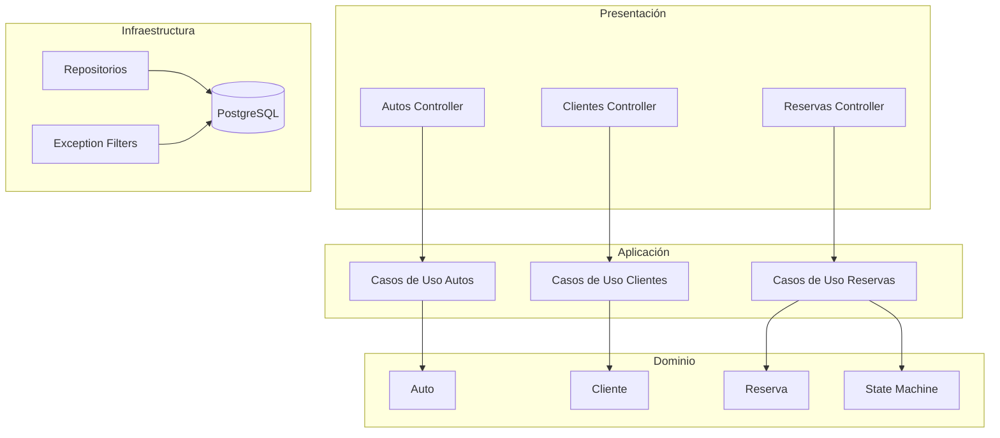

# Rentadora Autos API - Documentación

> Sistema de renta de autos construido con NestJS y Clean Architecture

## Tabla de Contenidos

| # | Documento | Descripción |
|---|-----------|-------------|
| 00 | [INDEX](00_INDEX.md) | Este archivo - índice general |
| 01 | [ARQUITECTURA](01_ARQUITECTURA.md) | Visión general de la arquitectura Clean Architecture |
| 02 | [ENTIDADES](02_ENTIDADES.md) | Entidades de dominio (Auto, Cliente, Reserva) |
| 03 | [CASOS_DE_USO](03_CASOS_DE_USO.md) | Catálogo completo de casos de uso |
| 04 | [API](04_API.md) | Endpoints REST y documentación Swagger |
| 05 | [MAQUINA_ESTADOS](05_MAQUINA_ESTADOS.md) | Máquina de estados de reservas |
| 06 | [EXCEPCIONES](06_EXCEPCIONES.md) | Excepciones personalizadas y filtros |
| 07 | [TESTING](07_TESTING.md) | Guía de pruebas E2E |

---

## Vista Rápida



---

## Comandos Principales

```bash
# Desarrollo
npm run build              # Compilar TypeScript
npm run start:dev          # Modo desarrollo (watch)
npm run start:prod         # Producción

# Testing
npm run test               # Tests unitarios
npm run test:e2e           # Tests E2E

# Verificación
npx tsc --noEmit          # Verificar tipos
```

---

## URLs Importantes

| Servicio | URL |
|----------|-----|
| API | http://localhost:3000 |
| Swagger | http://localhost:3000/api/docs |
| Base de datos | PostgreSQL (ver docker-compose.yml) |

---

## Tecnologías

- **Runtime**: Node.js
- **Framework**: NestJS 10.x
- **ORM**: MikroORM 6.x
- **Base de datos**: PostgreSQL
- **Validación**: class-validator
- **Documentación**: Swagger (OpenAPI 3.0)
- **Testing**: Jest + Supertest
