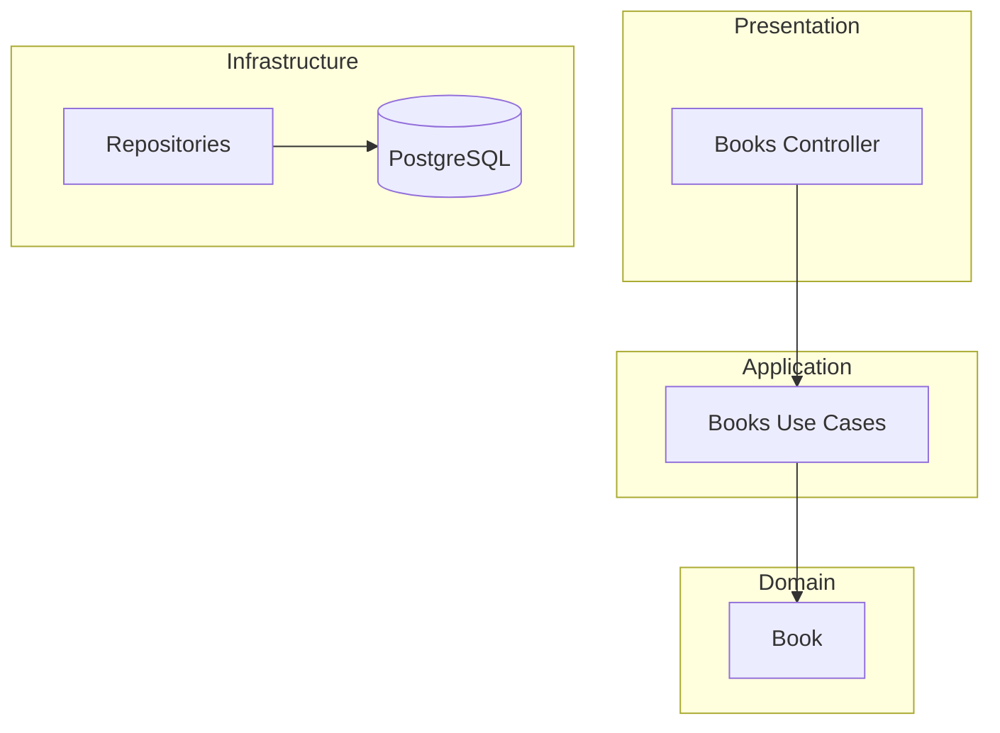

# Books API - Documentation

> REST API for managing books, built with NestJS and Clean Architecture

## Table of Contents

| #   | Document                                | Description                              |
| --- | --------------------------------------- | ---------------------------------------- |
| 00  | [INDEX](00_INDEX.md)                    | This file - general index                |
| 01  | [ARCHITECTURE](01_ARCHITECTURE.md)      | Clean Architecture overview              |
| 02  | [ENTITIES](02_ENTITIES.md)              | Domain entities (Book)                   |
| 03  | [USE_CASES](03_USE_CASES.md)            | Complete use case catalog                |
| 04  | [API](04_API.md)                        | REST endpoints and Swagger documentation |
| 07  | [TESTING](07_TESTING.md)                | E2E testing guide                        |
| —   | [USE_CASE_PATTERN](USE_CASE_PATTERN.md) | Use case isolation pattern guide         |

---

## Quick View



---

## Main Commands

```bash
# Development
pnpm build              # Compile TypeScript
pnpm start:dev          # Development mode (watch)
pnpm start:prod         # Production

# Testing
pnpm test               # Unit tests
pnpm test:e2e           # E2E tests

# Verification
npx tsc --noEmit        # Type check
```

---

## Important URLs

| Service  | URL                                 |
| -------- | ----------------------------------- |
| API      | http://localhost:3000               |
| Swagger  | http://localhost:3000/api           |
| Database | PostgreSQL (see docker-compose.yml) |

---

## Technologies

- **Runtime**: Node.js
- **Framework**: NestJS 10.x
- **ORM**: MikroORM 6.x
- **Database**: PostgreSQL
- **Validation**: class-validator
- **Documentation**: Swagger (OpenAPI 3.0)
- **Testing**: Jest + Supertest
