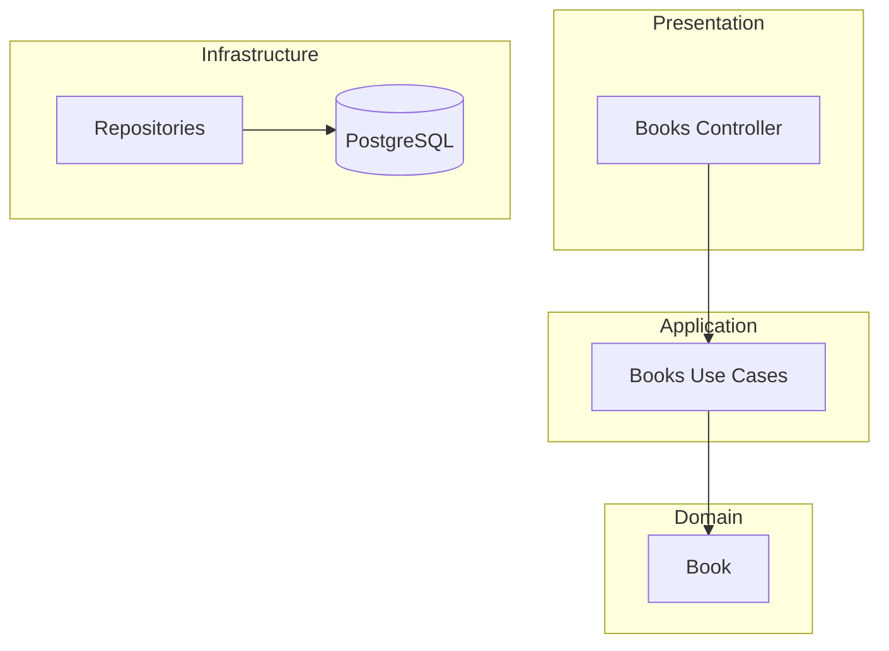

# Books API - Documentation

> REST API for managing books, built with NestJS and Clean Architecture

## Table of Contents

| # | Document | Description |
|---|----------|-------------|
| 00 | [INDEX](00_INDEX.md) | This file - general index |
| 01 | [ARCHITECTURE](01_ARCHITECTURE.md) | Clean Architecture overview |
| 02 | [ENTITIES](02_ENTITIES.md) | Domain entities (Book) |
| 03 | [USE_CASES](03_USE_CASES.md) | Complete use case catalog |
| 04 | [API](04_API.md) | REST endpoints and Swagger documentation |
| 07 | [TESTING](07_TESTING.md) | Testing guide (unit + e2e) |

---

## Quick View


```mermaid
graph TB
    subgraph Presentation
        C_B[Books Controller]
    end

    subgraph Application
        UC_B[Books Use Cases]
    end

    subgraph Domain
        E_B[Book]
    end

    subgraph Infrastructure
        DB[(PostgreSQL)]
        REP[Repositories]
    end

    C_B --> UC_B
    UC_B --> E_B
    REP --> DB
```

---

## Main Commands

```bash
# Development
pnpm build              # Compile TypeScript
pnpm start:dev          # Development mode (watch)
pnpm start:prod         # Production

# Testing
pnpm test               # Unit tests (domain entities)
pnpm test:e2e           # E2E tests (SQLite in-memory, no Docker)
pnpm test:cov           # Unit tests + coverage (coverage/unit/)
pnpm test:e2e:cov       # E2E tests + coverage (coverage/e2e/)

# Verification
npx tsc --noEmit        # Type check
pnpm lint               # Lint source code
pnpm format             # Format source code
pnpm check              # Lint + format + organize imports
```

---

## Important URLs

| Service | URL |
|---------|-----|
| API | http://localhost:3000 |
| Swagger | http://localhost:3000/api |
| Database | PostgreSQL (see docker-compose.yml); SQLite in-memory for e2e tests |

---

## Technologies

- **Runtime**: Node.js
- **Framework**: NestJS 11.x
- **ORM**: MikroORM 7.x
- **Database**: PostgreSQL (SQLite in-memory for e2e tests)
- **Validation**: class-validator
- **Documentation**: Swagger (OpenAPI 3.0)
- **Testing**: Jest 30 + Supertest
- **Seeding / Factories**: `@mikro-orm/seeder`, `@faker-js/faker`
- **Monitoring**: Sentry (`@sentry/nestjs`, disabled in dev, env-configurable in prod)
