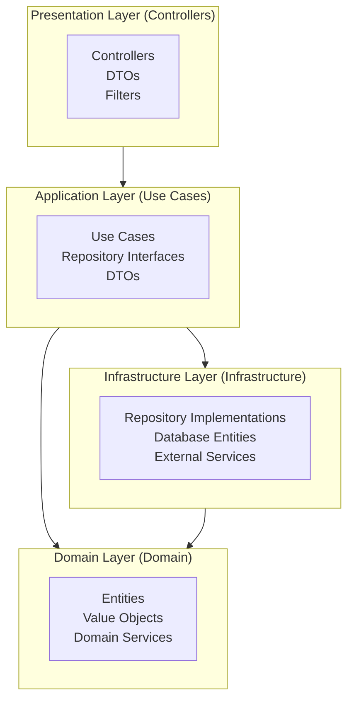
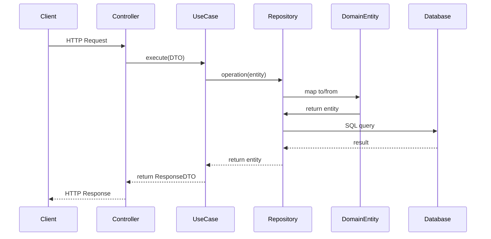
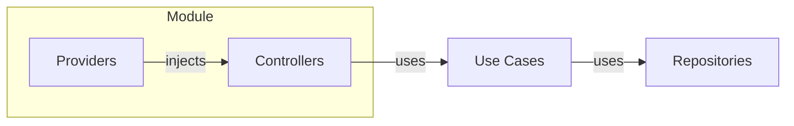
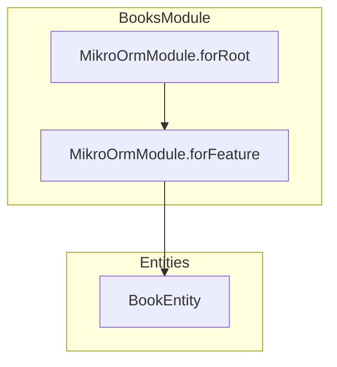

# Architecture - Clean Architecture

## Overview



## Core Principles

### 1. Separation of Concerns

| Layer              | Responsibility                 | Example                |
| ------------------ | ------------------------------ | ---------------------- |
| **Presentation**   | HTTP, DTOs, Swagger            | Controllers            |
| **Application**    | Business logic, Orchestration  | Use Cases              |
| **Domain**         | Pure entities, Business rules  | Book                   |
| **Infrastructure** | Persistence, External services | Repositories, MikroORM |

### 2. Folder Structure

```
src/
├── domain/
│   └── entities/
│       └── book.entity.ts          # Pure entity (no decorators)
│
├── application/
│   └── use-cases/
│       └── books/
│           ├── create-book/
│           ├── get-book/
│           ├── list-books/
│           ├── update-book/
│           └── delete-book/
│
├── infrastructure/
│   └── database/
│       └── postgres/
│           ├── entities/               # MikroORM entities
│           └── repositories/           # Implementations
│               └── books/
│
└── presentation/
    └── controllers/
        └── books/
            └── books.controller.ts
```

### 3. Data Flow



## Architecture Rules

### Pure Domain

```typescript
// ✅ CORRECT - Entity without decorators
export class Book {
    private readonly _id: string;
    private _title: string;

    static create(params: CreateBookParams): Book { ... }
    get title(): string { return this._title; }
}

// ❌ WRONG - Entity with MikroORM decorators
@Entity()
export class Book {
    @PrimaryKey()
    id: string;
}
```

### Repository per Operation

```typescript
// ✅ CORRECT - Specific repository per operation
export interface ICreateBookRepository {
    create(book: Book): Promise<Book>;
    existsByIsbn(isbn: string): Promise<boolean>;
}

// ❌ WRONG - Fat Repository
export interface IBookRepository {
    create(book: Book): Promise<Book>;
    get(id: string): Promise<Book>;
    list(): Promise<Book[]>;
    update(book: Book): Promise<Book>;
    delete(id: string): Promise<void>;
    // ... more methods
}
```

### Mandatory Transactions

```typescript
// ✅ CORRECT
async create(book: Book): Promise<Book> {
    return this.orm.em.transactional(async (em) => {
        await em.persist(book).flush();
        return book;
    });
}

// ❌ WRONG
async create(book: Book): Promise<Book> {
    await this.em.persist(book).flush(); // No transaction
    return book;
}
```

## Dependency Injection



### Provider Registration

```typescript
// books.module.ts
providers: [
    {
        provide: 'ICreateBookRepository',
        useClass: CreateBookRepository,
    },
    CreateBookUseCase,
    // ...
];
```

## MikroORM Configuration



## Build and Execution

```bash
# Build with NestJS CLI
pnpm build

# Run
pnpm start:prod

# Type check
npx tsc --noEmit
```
