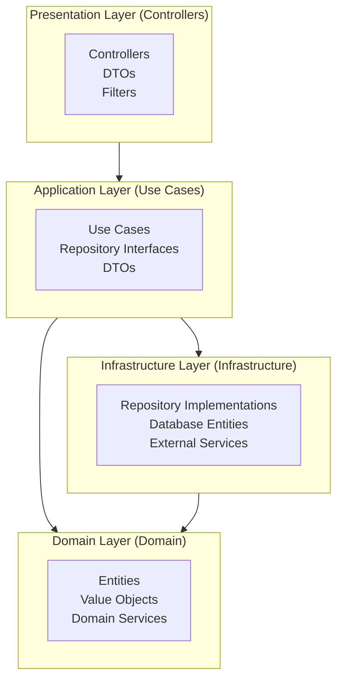
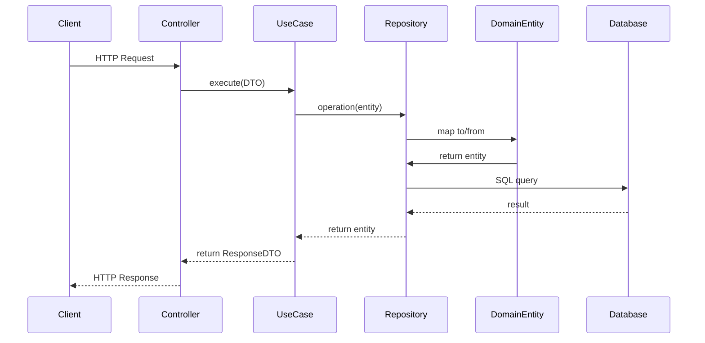
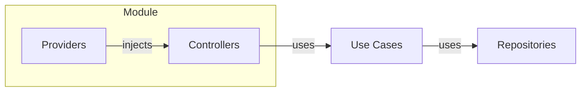
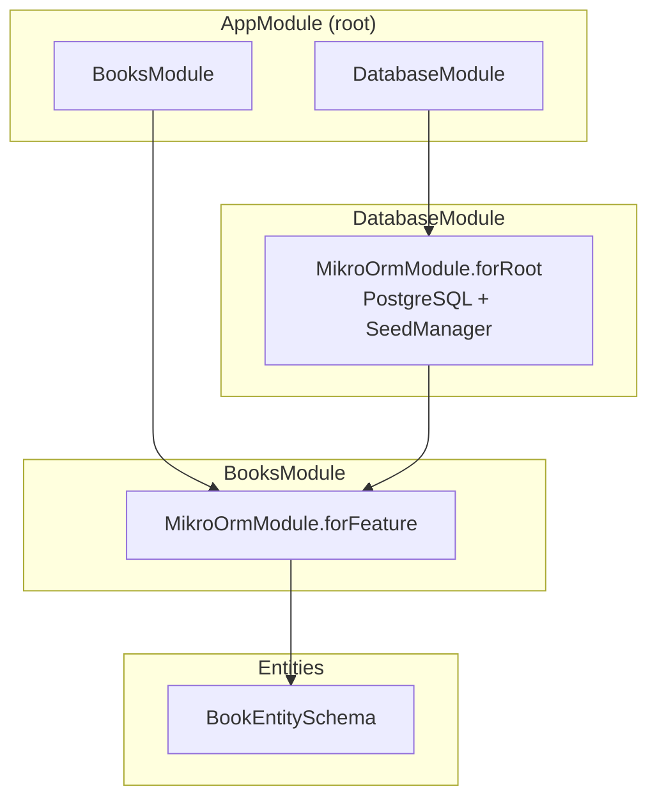

# Architecture - Clean Architecture

## Overview


```mermaid
graph TB
    subgraph C1["Presentation Layer (Controllers)"]
        CTRL[Controllers<br/>DTOs<br/>Filters]
    end

    subgraph C2["Application Layer (Use Cases)"]
        UC[Use Cases<br/>Repository Interfaces<br/>DTOs]
    end

    subgraph C3["Domain Layer (Domain)"]
        ENTITY[Entities<br/>Value Objects<br/>Domain Services]
    end

    subgraph C4["Infrastructure Layer (Infrastructure)"]
        REPO[Repository Implementations<br/>Database Entities<br/>External Services]
    end

    C1 --> C2
    C2 --> C3
    C4 --> C3
    C2 --> C4
```

## Core Principles

### 1. Separation of Concerns

| Layer | Responsibility | Example |
|-------|---------------|---------|
| **Presentation** | HTTP, DTOs, Swagger | Controllers |
| **Application** | Business logic, Orchestration | Use Cases |
| **Domain** | Pure entities, Business rules | Book |
| **Infrastructure** | Persistence, External services | Repositories, MikroORM |

### 2. Folder Structure

```
src/
├── app.module.ts                          # Root module (DatabaseModule + BooksModule)
├── books.module.ts                        # forFeature([BookEntitySchema])
│
├── domain/
│   └── entities/
│       ├── base.entity.ts                 # Abstract BaseEntity (id, createdAt, updatedAt, touch)
│       └── book.entity.ts                 # Book extends BaseEntity (no decorators)
│
├── application/
│   └── use-cases/
│       └── books/
│           ├── create-book/
│           ├── get-book/
│           ├── list-books/
│           ├── update-book/
│           └── delete-book/
│
├── infrastructure/
│   └── database/
│       ├── database.module.ts             # MikroOrmModule.forRoot (Postgres + SeedManager)
│       └── postgres/
│           ├── entities/
│           │   ├── base.entity.ts         # BaseEntitySchema (defineEntity, abstract)
│           │   └── book.entity.ts         # BookEntity extends BaseEntity
│           ├── factories/                 # MikroORM seeder factories (test seed data)
│           │   └── book.factory.ts
│           └── repositories/
│               └── books/
│
└── presentation/
    └── controllers/
        └── books/
            └── books.controller.ts
```

### 3. Data Flow


```mermaid
sequenceDiagram
    participant Client
    participant Controller
    participant UseCase
    participant Repository
    participant DomainEntity
    participant Database

    Client->>Controller: HTTP Request
    Controller->>UseCase: execute(DTO)
    UseCase->>Repository: operation(entity)
    Repository->>DomainEntity: map to/from
    DomainEntity->>Repository: return entity
    Repository->>Database: SQL query
    Database-->>Repository: result
    Repository-->>UseCase: return entity
    UseCase-->>Controller: return ResponseDTO
    Controller-->>Client: HTTP Response
```

## Architecture Rules

### Pure Domain

```typescript
// ✅ CORRECT - Entity extends BaseEntity, no decorators
import { BaseEntity, generateBaseEntityProps } from './base.entity';

export class Book extends BaseEntity {
    private _title: string;

    static create(params: CreateBookParams): Book {
        return new Book({ ...generateBaseEntityProps(), title: params.title, /* ... */ });
    }

    get title(): string { return this._title; }
}

// ❌ WRONG - Domain entity with MikroORM decorators
// (MikroORM 7 removed decorators — use defineEntity in infrastructure layer instead)
```

> **Note**: `BaseEntity` (domain) and `BaseEntitySchema` (infra) share the
> same `id`, `createdAt`, and `updatedAt` contract. The domain `BaseEntity`
> holds them as plain private fields with a `protected touch()`; the infra
> `BaseEntitySchema` maps them to columns via `defineEntity({ abstract: true })`.
> Domain entities extend the domain `BaseEntity`; MikroORM entities extend the
> infra `BaseEntity`.

### Repository per Operation

```typescript
// ✅ CORRECT - Specific repository per operation
export interface ICreateBookRepository {
    create(book: Book): Promise<Book>;
    existsByIsbn(isbn: string): Promise<boolean>;
}

// ❌ WRONG - Fat Repository
export interface IBookRepository {
    create(book: Book): Promise<Book>;
    get(id: string): Promise<Book>;
    list(): Promise<Book[]>;
    update(book: Book): Promise<Book>;
    delete(id: string): Promise<void>;
    // ... more methods
}
```

### Mandatory Transactions

```typescript
// ✅ CORRECT
async create(book: Book): Promise<Book> {
    return this.orm.em.transactional(async (em) => {
        await em.persist(book).flush();
        return book;
    });
}

// ❌ WRONG
async create(book: Book): Promise<Book> {
    await this.em.persist(book).flush(); // No transaction
    return book;
}
```

## Dependency Injection


```mermaid
graph LR
    subgraph Module
        PROVIDER[Providers]
        CONTROLLER[Controllers]
    end

    PROVIDER -->|injects| CONTROLLER
    CONTROLLER -->|uses| USECASE[Use Cases]
    USECASE -->|uses| REPO[Repositories]
```

### Provider Registration

```typescript
// books.module.ts
providers: [
    {
        provide: 'ICreateBookRepository',
        useClass: CreateBookRepository,
    },
    CreateBookUseCase,
    // ...
]
```

## MikroORM Configuration


```mermaid
graph TB
    subgraph AppModule["AppModule (root)"]
        DBMOD[DatabaseModule]
        BOOKSMOD[BooksModule]
    end

    subgraph DatabaseModule["DatabaseModule"]
        A[MikroOrmModule.forRoot<br/>PostgreSQL + SeedManager]
    end

    subgraph BooksModule["BooksModule"]
        B[MikroOrmModule.forFeature]
    end

    subgraph Entities
        C[BookEntitySchema]
    end

    DBMOD --> A
    BOOKSMOD --> B
    A --> B
    B --> C
```

`forRoot()` lives in `DatabaseModule` (PostgreSQL + `SeedManager` extension);
`BooksModule` only registers `forFeature([BookEntitySchema])`. `AppModule`
imports both, and `main.ts` bootstraps `AppModule`.

## Build and Execution

```bash
# Build with NestJS CLI
pnpm build

# Run
pnpm start:prod

# Type check
npx tsc --noEmit
```
