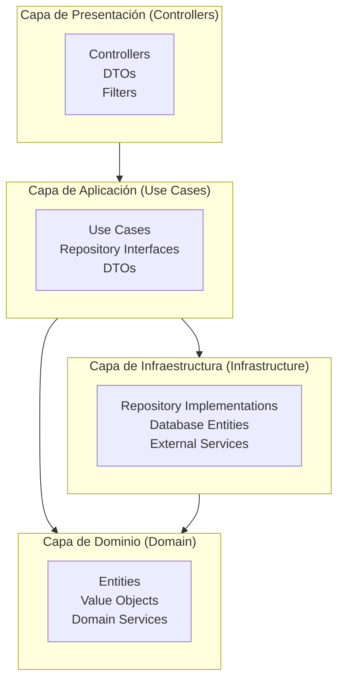
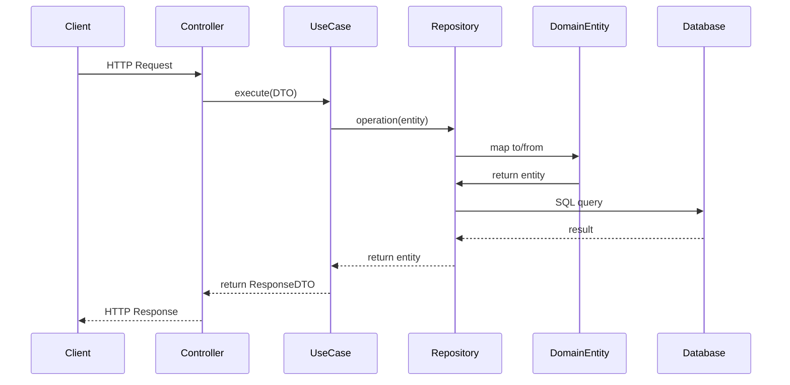
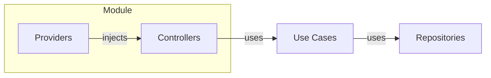
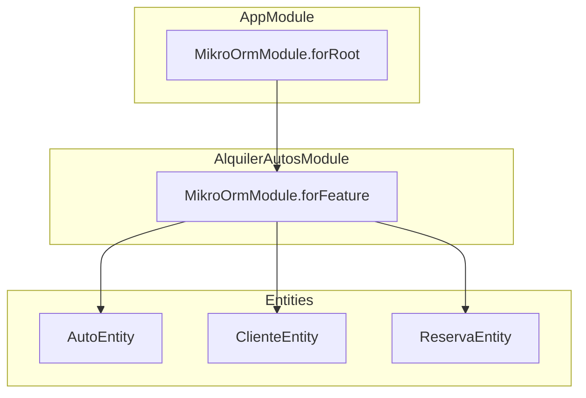
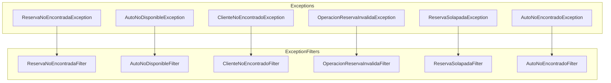

# Arquitectura - Clean Architecture

## Visión General



## Principios Fundamentales

### 1. Separación de Responsabilidades

| Capa | Responsabilidad | Ejemplo |
|------|----------------|---------|
| **Presentación** | HTTP, DTOs, Swagger | Controllers, Filters |
| **Aplicación** | Lógica de negocio, Orquestación | Use Cases |
| **Dominio** | Entidades puras, Reglas de negocio | Auto, Cliente, Reserva |
| **Infraestructura** | Persistencia, Servicios externos | Repositories, MikroORM |

### 2. Estructura de Carpetas

```
src/
├── domain/
│   ├── entities/
│   │   ├── auto.entity.ts          # Entidad pura (sin decoradores)
│   │   ├── cliente.entity.ts
│   │   ├── reserva.entity.ts
│   │   ├── reserva.state-machine.ts # Máquina de estados
│   │   └── reserva.constants.ts     # Constantes compartidas
│   └── exceptions/
│       └── reserva.exceptions.ts     # Excepciones de dominio
│
├── application/
│   └── use-cases/
│       ├── autos/
│       │   ├── crear-auto/
│       │   ├── obtener-auto/
│       │   ├── listar-autos/
│       │   ├── actualizar-auto/
│       │   └── eliminar-auto/
│       ├── clientes/
│       │   └── [misma estructura]
│       └── reservas/
│           └── [misma estructura]
│
├── infrastructure/
│   ├── database/
│   │   └── postgres/
│   │       ├── entities/               # Entidades MikroORM
│   │       └── repositories/           # Implementaciones
│   └── exceptions/
│       └── reserva.exception-filters.ts
│
└── presentation/
    └── controllers/
        ├── autos.controller.ts
        ├── clientes.controller.ts
        └── reservas.controller.ts
```

### 3. Flujo de Datos



## Reglas de Arquitectura

### Dominio Puro

```typescript
// ✅ CORRECTO - Entidad sin decoradores
export class Auto {
    private readonly _id: string;
    private _marca: string;

    static create(params: CrearAutoParams): Auto { ... }
    get marca(): string { return this._marca; }
}

// ❌ INCORRECTO - Entidad con decoradores MikroORM
@Entity()
export class Auto {
    @PrimaryKey()
    id: string;
}
```

### Repository por Operación

```typescript
// ✅ CORRECTO - Repository específico por operación
export interface ICrearAutoRepository {
    crear(auto: Auto): Promise<Auto>;
    existePorPatente(patente: string): Promise<boolean>;
}

// ❌ INCORRECTO - Fat Repository
export interface IAutoRepository {
    crear(auto: Auto): Promise<Auto>;
    obtener(id: string): Promise<Auto>;
    listar(): Promise<Auto[]>;
    // ... 15 métodos más
}
```

### Transacciones Obligatorias

```typescript
// ✅ CORRECTO
async crear(auto: Auto): Promise<Auto> {
    return this.orm.em.transactional(async (em) => {
        await em.persist(auto).flush();
        return auto;
    });
}

// ❌ INCORRECTO
async crear(auto: Auto): Promise<Auto> {
    await this.em.persist(auto).flush(); // Sin transacción
    return auto;
}
```

## Inyección de Dependencias



### Registro de Providers

```typescript
// alquiler-autos.module.ts
providers: [
    {
        provide: 'ICrearAutoRepository',
        useClass: CrearAutoRepository,
    },
    CrearAutoUseCase,
    // ...
]
```

## Configuración de MikroORM



## Excepciones y Filtros



## Build y Ejecución

```bash
# Build con NestJS CLI
node ./node_modules/.bin/nest build

# Ejecutar
node dist/main.js

# Verificar tipos
npx tsc --noEmit
```
