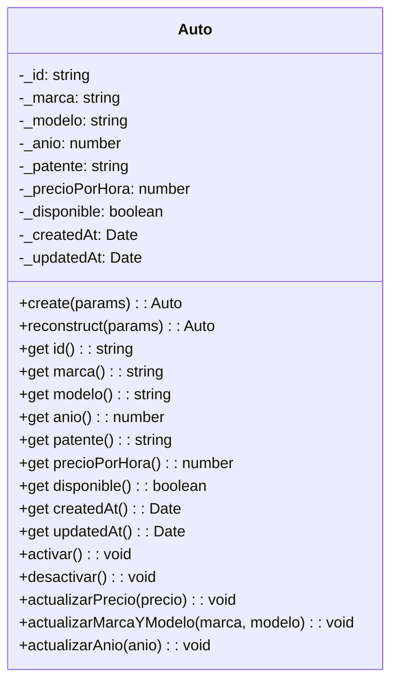
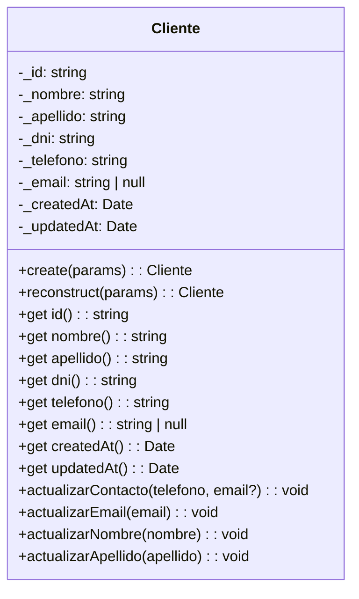
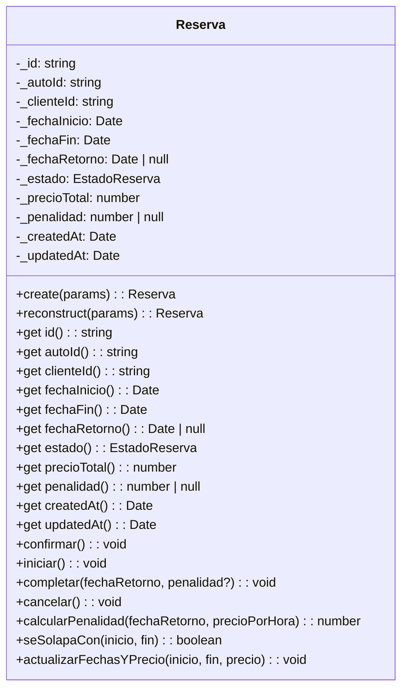
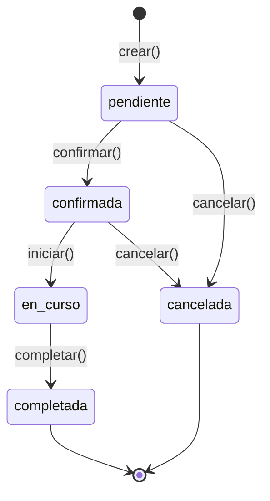

# Entidades de Dominio

## Auto



### Propiedades

| Propiedad | Tipo | Descripción |
|-----------|------|-------------|
| `id` | `string` | UUID único |
| `marca` | `string` | Marca del vehículo |
| `modelo` | `string` | Modelo del vehículo |
| `anio` | `number` | Año de fabricación |
| `patente` | `string` | Patente única |
| `precioPorHora` | `number` | Precio por hora de alquiler |
| `disponible` | `boolean` | Si está disponible para alquiler |
| `createdAt` | `Date` | Fecha de creación |
| `updatedAt` | `Date` | Fecha de última modificación |

### Métodos de Comportamiento

```typescript
// Activar disponibilidad
auto.activar(): void

// Desactivar disponibilidad
auto.desactivar(): void

// Actualizar precio (valida > 0)
auto.actualizarPrecio(precio: number): void

// Actualizar marca y modelo
auto.actualizarMarcaYModelo(marca: string, modelo: string): void

// Actualizar año
auto.actualizarAnio(anio: number): void
```

---

## Cliente



### Propiedades

| Propiedad | Tipo | Descripción |
|-----------|------|-------------|
| `id` | `string` | UUID único |
| `nombre` | `string` | Nombre |
| `apellido` | `string` | Apellido |
| `dni` | `string` | DNI (único, inmutable) |
| `telefono` | `string` | Teléfono de contacto |
| `email` | `string \| null` | Email (opcional) |
| `createdAt` | `Date` | Fecha de creación |
| `updatedAt` | `Date` | Fecha de última modificación |

### Métodos de Comportamiento

```typescript
// Actualizar contacto (teléfono y email)
cliente.actualizarContacto(telefono: string, email?: string | null): void

// Actualizar solo email
cliente.actualizarEmail(email: string | null): void

// Actualizar nombre
cliente.actualizarNombre(nombre: string): void

// Actualizar apellido
cliente.actualizarApellido(apellido: string): void
```

**Nota**: El DNI es inmutable después de la creación.

---

## Reserva



### Estados de Reserva



### Propiedades

| Propiedad | Tipo | Descripción |
|-----------|------|-------------|
| `id` | `string` | UUID único |
| `autoId` | `string` | ID del auto reservado |
| `clienteId` | `string` | ID del cliente |
| `fechaInicio` | `Date` | Fecha/hora de inicio |
| `fechaFin` | `Date` | Fecha/hora de fin |
| `fechaRetorno` | `Date \| null` | Fecha real de retorno |
| `estado` | `EstadoReserva` | Estado actual |
| `precioTotal` | `number` | Precio total calculado |
| `penalidad` | `number \| null` | Penalidad por demora |
| `createdAt` | `Date` | Fecha de creación |
| `updatedAt` | `Date` | Fecha de última modificación |

### Estados Posibles

| Estado | Valor | Descripción |
|--------|-------|-------------|
| `PENDIENTE` | `'pendiente'` | Reservada pero no confirmada |
| `CONFIRMADA` | `'confirmada'` | Confirmada, esperando inicio |
| `EN_CURSO` | `'en_curso'` | El auto está en uso |
| `COMPLETADA` | `'completada'` | Alquiler finalizado |
| `CANCELADA` | `'cancelada'` | Reserva cancelada |

### Métodos de Comportamiento

```typescript
// Transiciones de estado
reserva.confirmar(): void
reserva.iniciar(): void
reserva.completar(fechaRetorno: Date, penalidad?: number): void
reserva.cancelar(): void

// Cálculo de penalidad por atraso
// Tolerancia: 15 minutos
// Luego: 120% del precio por hora por cada hora excedida
reserva.calcularPenalidad(fechaRetorno: Date, precioPorHora: number): number

// Verificar solapamiento con otro período
reserva.seSolapaCon(otraFechaInicio: Date, otraFechaFin: Date): boolean

// Actualizar fechas y precio
reserva.actualizarFechasYPrecio(
    fechaInicio: Date,
    fechaFin: Date,
    precioTotal: number
): void
```

### Penalidades

```typescript
export const PENALIDAD = {
    TOLERANCIA_MINUTOS: 15,  // Tolerancia sin cargo
    MULTIPLICADOR: 1.2,       // 120% del precio/hora
};
```

### Ejemplo de Uso

```typescript
// Crear una reserva
const reserva = Reserva.create({
    autoId: 'uuid-auto',
    clienteId: 'uuid-cliente',
    fechaInicio: new Date('2026-04-10T10:00:00'),
    fechaFin: new Date('2026-04-12T10:00:00'),
    precioTotal: 5000,
});

// Confirmar la reserva
reserva.confirmar();

// Verificar solapamiento
const seSolapa = reserva.seSolapaCon(
    new Date('2026-04-11'),
    new Date('2026-04-13')
);

// Calcular penalidad si devuelve tarde
const penalidad = reserva.calcularPenalidad(
    new Date('2026-04-12T12:00:00'),  // 2 horas tarde
    1000  // precio por hora
);
// penalidad = 2400 (2 horas × 1000 × 1.2)
```

---

## Interfaces de Repository

### ICrearAutoRepository

```typescript
export interface ICrearAutoRepository {
    crear(auto: Auto): Promise<Auto>;
    existePorPatente(patente: string): Promise<boolean>;
}
```

### IListarAutosRepository

```typescript
export interface IListarAutosRepository {
    listarTodos(): Promise<Auto[]>;
    listarDisponibles(): Promise<Auto[]>;
}
```

### IReservaRepository (ejemplo genérico)

```typescript
export interface ICrearReservaRepository {
    crear(reserva: Reserva): Promise<Reserva>;
    existeSolapamiento(
        autoId: string,
        fechaInicio: Date,
        fechaFin: Date,
    ): Promise<boolean>;
}
```
