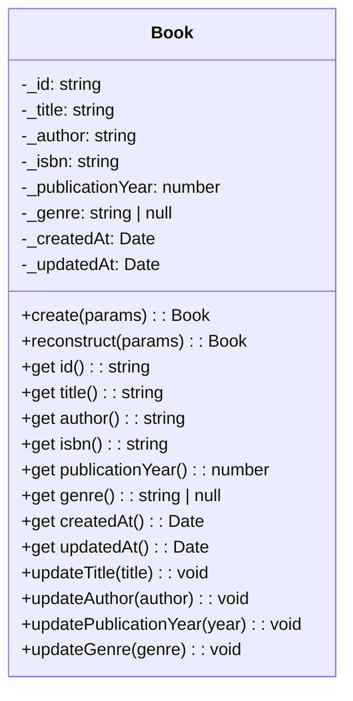

# Domain Entities

## Book



### Properties

| Property          | Type             | Description                     |
| ----------------- | ---------------- | ------------------------------- |
| `id`              | `string`         | Unique UUIDv7                   |
| `title`           | `string`         | Book title                      |
| `author`          | `string`         | Author name                     |
| `isbn`            | `string`         | ISBN (unique, immutable)        |
| `publicationYear` | `number`         | Year of publication (1000–9999) |
| `genre`           | `string \| null` | Genre (optional)                |
| `createdAt`       | `Date`           | Creation timestamp              |
| `updatedAt`       | `Date`           | Last modification timestamp     |

**Note**: `isbn` is immutable after creation.

### Behavior Methods

```typescript
// Update title
book.updateTitle(title: string): void

// Update author
book.updateAuthor(author: string): void

// Update publication year
book.updatePublicationYear(year: number): void

// Update genre (can be set to null)
book.updateGenre(genre: string | null): void
```

### Factory Methods

```typescript
// Create a new book (generates UUIDv7 and timestamps)
const book = Book.create({
    title: 'Clean Architecture',
    author: 'Robert C. Martin',
    isbn: '978-0-13-468599-1',
    publicationYear: 2017,
    genre: 'Software Engineering',
});

// Reconstruct from persisted data (preserves existing id and timestamps)
const book = Book.reconstruct({
    id: 'existing-uuid',
    title: 'Clean Architecture',
    author: 'Robert C. Martin',
    isbn: '978-0-13-468599-1',
    publicationYear: 2017,
    genre: 'Software Engineering',
    createdAt: new Date('2024-01-01'),
    updatedAt: new Date('2024-01-01'),
});
```

---

## Repository Interfaces

### ICreateBookRepository

```typescript
export interface ICreateBookRepository {
    create(book: Book): Promise<Book>;
    existsByIsbn(isbn: string): Promise<boolean>;
}
```

### IGetBookRepository

```typescript
export interface IGetBookRepository {
    findById(id: string): Promise<Book | null>;
}
```

### IListBooksRepository

```typescript
export interface IListBooksRepository {
    findAll(): Promise<Book[]>;
}
```

### IUpdateBookRepository

```typescript
export interface IUpdateBookRepository {
    findById(id: string): Promise<Book | null>;
    save(book: Book): Promise<Book>;
}
```

### IDeleteBookRepository

```typescript
export interface IDeleteBookRepository {
    findById(id: string): Promise<Book | null>;
    delete(id: string): Promise<void>;
}
```
