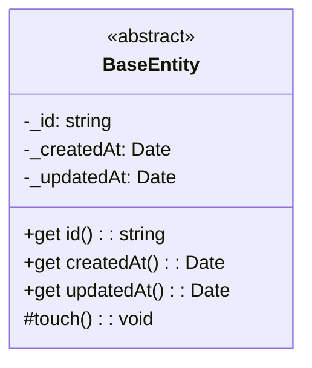
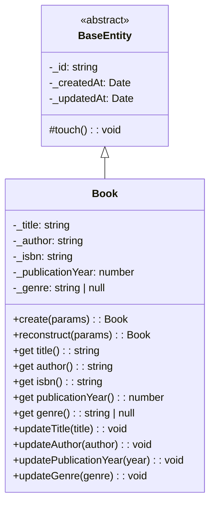

# Domain Entities

## BaseEntity

Abstract base class shared by every domain entity. Holds identity and
timestamp fields; subclasses own their own state and call `touch()` on
mutation.


```mermaid
classDiagram
    class BaseEntity {
        <<abstract>>
        -_id: string
        -_createdAt: Date
        -_updatedAt: Date
        +get id(): string
        +get createdAt(): Date
        +get updatedAt(): Date
        #touch(): void
    }
```

| Property | Type | Description |
|----------|------|-------------|
| `id` | `string` | UUIDv7, generated in `generateBaseEntityProps()` |
| `createdAt` | `Date` | Creation timestamp (immutable) |
| `updatedAt` | `Date` | Last modification timestamp (advanced by `touch()`) |

`touch()` is `protected` — subclasses call it from their `updateX` methods to
bump `updatedAt`. The domain `BaseEntity` is mirrored by the infra
`BaseEntitySchema` (`defineEntity({ abstract: true })`), which maps the same
fields to columns.

> **Note**: There is no `deletedAt` field. Soft delete is a per-aggregate
> decision, not a cross-cutting concern — adding it to `BaseEntity` would force
> every entity into the same deletion model.

---

## Book


```mermaid
classDiagram
    class BaseEntity {
        <<abstract>>
        -_id: string
        -_createdAt: Date
        -_updatedAt: Date
        #touch(): void
    }
    class Book {
        -_title: string
        -_author: string
        -_isbn: string
        -_publicationYear: number
        -_genre: string | null
        +create(params): Book
        +reconstruct(params): Book
        +get title(): string
        +get author(): string
        +get isbn(): string
        +get publicationYear(): number
        +get genre(): string | null
        +updateTitle(title): void
        +updateAuthor(author): void
        +updatePublicationYear(year): void
        +updateGenre(genre): void
    }
    BaseEntity <|-- Book
```

### Properties

| Property | Type | Description |
|----------|------|-------------|
| `id` | `string` | Unique UUIDv7 (inherited from `BaseEntity`) |
| `title` | `string` | Book title |
| `author` | `string` | Author name |
| `isbn` | `string` | ISBN (unique, immutable) |
| `publicationYear` | `number` | Year of publication (1000–9999) |
| `genre` | `string \| null` | Genre (optional) |
| `createdAt` | `Date` | Creation timestamp (inherited from `BaseEntity`) |
| `updatedAt` | `Date` | Last modification timestamp (inherited from `BaseEntity`) |

**Note**: `isbn` is immutable after creation. `id`, `createdAt`, and
`updatedAt` come from `BaseEntity` — `Book` only declares its own state.

### Behavior Methods

```typescript
// Update title (bumps updatedAt via touch())
book.updateTitle(title: string): void

// Update author
book.updateAuthor(author: string): void

// Update publication year
book.updatePublicationYear(year: number): void

// Update genre (can be set to null)
book.updateGenre(genre: string | null): void
```

### Factory Methods

```typescript
// Create a new book (generates UUIDv7 and timestamps via generateBaseEntityProps())
const book = Book.create({
    title: 'Clean Architecture',
    author: 'Robert C. Martin',
    isbn: '978-0-13-468599-1',
    publicationYear: 2017,
    genre: 'Software Engineering',
});

// Reconstruct from persisted data — takes BaseEntityProps (id, createdAt, updatedAt)
const book = Book.reconstruct({
    id: 'existing-uuid',
    createdAt: new Date('2024-01-01'),
    updatedAt: new Date('2024-01-01'),
    title: 'Clean Architecture',
    author: 'Robert C. Martin',
    isbn: '978-0-13-468599-1',
    publicationYear: 2017,
    genre: 'Software Engineering',
});
```

> **Note**: `reconstruct` takes `BaseEntityProps` (`id`, `createdAt`,
> `updatedAt`) as part of its params, since those fields live on `BaseEntity`.

Repository interfaces live next to each use case under
`src/application/use-cases/books/<action>-book/` and follow the
one-repository-per-operation pattern documented in `AGENTS.md` and
`docs/USE_CASE_PATTERN.md`.
