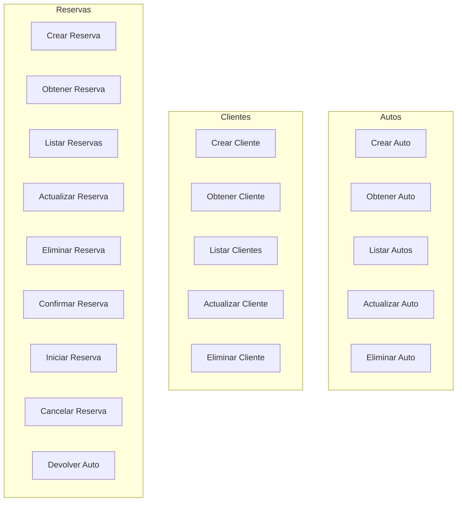
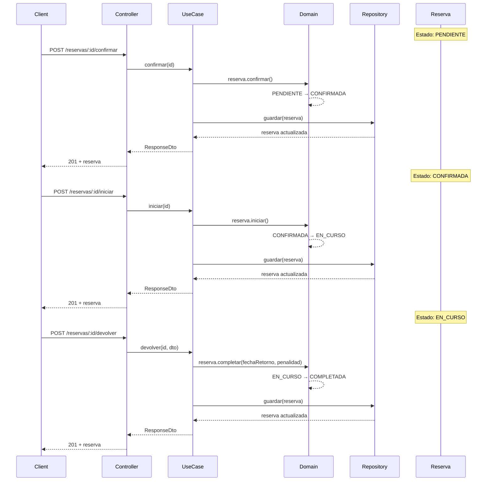

# Casos de Uso

## Catálogo Completo



---

## Autos

### Crear Auto

```typescript
// crear-auto.use-case.ts
export class CrearAutoUseCase {
    async execute(dto: CrearAutoRequestDto): Promise<CrearAutoResponseDto> {
        // 1. Validar patente única
        const existe = await this.repository.existePorPatente(dto.patente);
        if (existe) throw new BadRequestException('Patente duplicada');

        // 2. Crear entidad de dominio
        const auto = Auto.create({
            marca: dto.marca,
            modelo: dto.modelo,
            anio: dto.anio,
            patente: dto.patente,
            precioPorHora: dto.precioPorHora,
        });

        // 3. Persistir
        const guardado = await this.repository.crear(auto);
        return toResponseDto(guardado);
    }
}
```

### Listar Autos

```typescript
// listar-autos.use-case.ts
export class ListarAutosUseCase {
    async execute(dto: ListarAutosRequestDto): Promise<ListarAutosResponseDto> {
        const autos = dto.soloDisponibles
            ? await this.repository.listarDisponibles()
            : await this.repository.listarTodos();

        return { autos: autos.map(toResponseDto) };
    }
}
```

### Actualizar Auto

```typescript
// actualizar-auto.use-case.ts
export class ActualizarAutoUseCase {
    async execute(id: string, dto: ActualizarAutoRequestDto): Promise<ActualizarAutoResponseDto> {
        // 1. Obtener auto existente
        const auto = await this.repository.obtenerPorId(id);
        if (!auto) throw new NotFoundException('Auto no encontrado');

        // 2. Validar patente única si cambia
        if (dto.patente) {
            const existe = await this.repository.existePorPatente(dto.patente, id);
            if (existe) throw new BadRequestException('Patente duplicada');
        }

        // 3. Actualizar usando métodos de dominio
        if (dto.disponible !== undefined) {
            dto.disponible ? auto.activar() : auto.desactivar();
        }

        // 4. Persistir y retornar
        return toResponseDto(await this.repository.guardar(auto));
    }
}
```

---

## Clientes

### Crear Cliente

```typescript
// crear-cliente.use-case.ts
export class CrearClienteUseCase {
    async execute(dto: CrearClienteRequestDto): Promise<CrearClienteResponseDto> {
        // 1. Validar DNI único
        const existe = await this.repository.existePorDni(dto.dni);
        if (existe) throw new BadRequestException('DNI duplicado');

        // 2. Crear entidad
        const cliente = Cliente.create({
            nombre: dto.nombre,
            apellido: dto.apellido,
            dni: dto.dni,
            telefono: dto.telefono,
            email: dto.email,
        });

        // 3. Persistir
        return toResponseDto(await this.repository.crear(cliente));
    }
}
```

### Actualizar Cliente

```typescript
// actualizar-cliente.use-case.ts
export class ActualizarClienteUseCase {
    async execute(id: string, dto: ActualizarClienteRequestDto): Promise<ActualizarClienteResponseDto> {
        // 1. Obtener cliente
        const cliente = await this.repository.obtenerPorId(id);
        if (!cliente) throw new NotFoundException('Cliente no encontrado');

        // 2. Validar DNI único si cambia
        if (dto.dni) {
            const existe = await this.repository.existePorDni(dto.dni, id);
            if (existe) throw new BadRequestException('DNI duplicado');
        }

        // 3. Actualizar contacto usando método de dominio
        if (dto.telefono || dto.email !== undefined) {
            cliente.actualizarContacto(
                dto.telefono ?? cliente.telefono,
                dto.email ?? cliente.email,
            );
        }

        // 4. Persistir
        return toResponseDto(await this.repository.guardar(cliente));
    }
}
```

---

## Reservas

### Crear Reserva

```typescript
// crear-reserva.use-case.ts
export class CrearReservaUseCase {
    async execute(dto: CrearReservaRequestDto): Promise<CrearReservaResponseDto> {
        // 1. Verificar auto existe
        const auto = await this.repository.obtenerAutoPorId(dto.autoId);
        if (!auto) throw new AutoNoEncontradoException();

        // 2. Verificar auto disponible
        if (!auto.disponible) throw new AutoNoDisponibleException();

        // 3. Verificar cliente existe
        const cliente = await this.repository.obtenerClientePorId(dto.clienteId);
        if (!cliente) throw new ClienteNoEncontradoException();

        // 4. Verificar no hay solapamiento
        const tieneSolapamiento = await this.repository.existeSolapamiento(
            dto.autoId,
            dto.fechaInicio,
            dto.fechaFin,
        );
        if (tieneSolapamiento) throw new ReservaSolapadaException();

        // 5. Crear reserva
        const reserva = Reserva.create({
            autoId: dto.autoId,
            clienteId: dto.clienteId,
            fechaInicio: dto.fechaInicio,
            fechaFin: dto.fechaFin,
            precioTotal: dto.precioTotal,
        });

        // 6. Persistir
        return toResponseDto(await this.repository.crear(reserva));
    }
}
```

### Transiciones de Estado



### Confirmar Reserva

```typescript
// confirmar-reserva.use-case.ts
export class ConfirmarReservaUseCase {
    async execute(id: string): Promise<ConfirmarReservaResponseDto> {
        const reserva = await this.repository.obtenerPorId(id);
        if (!reserva) throw new ReservaNoEncontradaException();

        reserva.confirmar();
        return toResponseDto(await this.repository.guardar(reserva));
    }
}
```

### Iniciar Reserva

```typescript
// iniciar-reserva.use-case.ts
export class IniciarReservaUseCase {
    async execute(id: string): Promise<IniciarReservaResponseDto> {
        const reserva = await this.repository.obtenerPorId(id);
        if (!reserva) throw new ReservaNoEncontradaException();

        reserva.iniciar();
        return toResponseDto(await this.repository.guardar(reserva));
    }
}
```

### Cancelar Reserva

```typescript
// cancelar-reserva.use-case.ts
export class CancelarReservaUseCase {
    async execute(id: string): Promise<CancelarReservaResponseDto> {
        const reserva = await this.repository.obtenerPorId(id);
        if (!reserva) throw new ReservaNoEncontradaException();

        reserva.cancelar();
        return toResponseDto(await this.repository.guardar(reserva));
    }
}
```

### Devolver Auto

```typescript
// devolver-auto.use-case.ts
export class DevolverAutoUseCase {
    async execute(id: string, dto: DevolverAutoRequestDto): Promise<DevolverAutoResponseDto> {
        const reserva = await this.repository.obtenerPorId(id);
        if (!reserva) throw new ReservaNoEncontradaException();

        if (reserva.estado !== ESTADOS_RESERVA.EN_CURSO) {
            throw new OperacionReservaInvalidaException('Solo se puede devolver de una reserva en curso');
        }

        const auto = await this.repository.obtenerAutoPorId(reserva.autoId);
        if (!auto) throw new AutoNoEncontradoException();

        // Calcular penalidad si hay atraso
        const fechaRetorno = new Date(dto.fechaRetorno);
        const penalidad = reserva.calcularPenalidad(fechaRetorno, auto.precioPorHora);

        reserva.completar(fechaRetorno, penalidad > 0 ? penalidad : null);

        return toResponseDto(await this.repository.guardar(reserva));
    }
}
```

### Actualizar Reserva

```typescript
// actualizar-reserva.use-case.ts
export class ActualizarReservaUseCase {
    async execute(id: string, dto: ActualizarReservaRequestDto): Promise<ActualizarReservaResponseDto> {
        const reserva = await this.repository.obtenerPorId(id);
        if (!reserva) throw new ReservaNoEncontradaException();

        // Validar fechas si se proporcionan
        if (dto.fechaInicio && dto.fechaFin) {
            if (new Date(dto.fechaInicio) >= new Date(dto.fechaFin)) {
                throw new BadRequestException('Fecha inicio debe ser anterior a fecha fin');
            }
        }

        // Usar método de dominio para actualizar
        reserva.actualizarFechasYPrecio(
            dto.fechaInicio ?? reserva.fechaInicio,
            dto.fechaFin ?? reserva.fechaFin,
            dto.precioTotal ?? reserva.precioTotal,
        );

        return toResponseDto(await this.repository.guardar(reserva));
    }
}
```

---

## Estructura de Archivos por Caso de Uso

```
application/use-cases/{dominio}/{accion}-{entidad}/
├── {accion}-{entidad}.use-case.ts              # Implementación
├── {accion}-{entidad}.request.dto.ts           # DTO de entrada
├── {accion}-{entidad}.response.dto.ts          # DTO de salida
├── {accion}-{entidad}.repository.interface.ts # Contrato de repository
└── README.md                                  # Documentación
```

## Interfaces de Repository

Cada caso de uso define su propia interfaz de repository:

```typescript
// ICrearAutoRepository
export interface ICrearAutoRepository {
    crear(auto: Auto): Promise<Auto>;
    existePorPatente(patente: string): Promise<boolean>;
}

// IObtenerAutoRepository
export interface IObtenerAutoRepository {
    obtenerPorId(id: string): Promise<Auto | null>;
}

// IConfirmarReservaRepository
export interface IConfirmarReservaRepository {
    obtenerPorId(id: string): Promise<Reserva | null>;
    guardar(reserva: Reserva): Promise<Reserva>;
}
```
