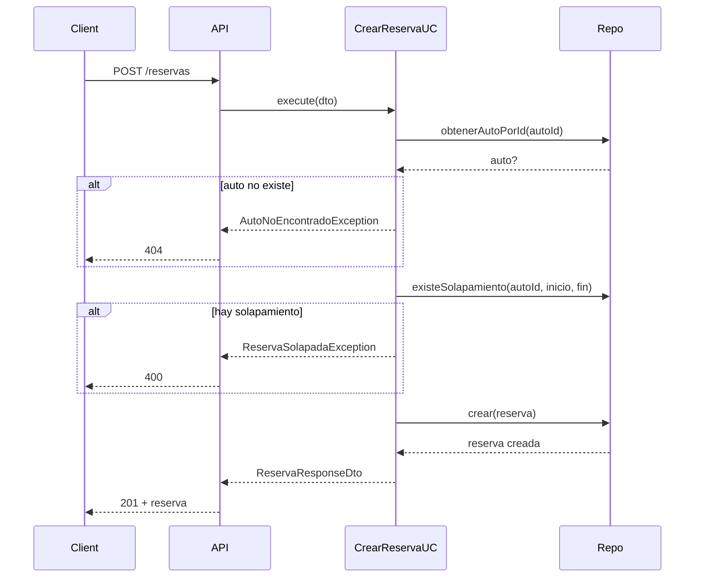

# API REST - Endpoints

## Base URL

```
http://localhost:3000
```

## Swagger Documentation

```
http://localhost:3000/api/docs
```

---

## Autos

### Crear Auto

```
POST /autos
```

**Request Body:**
```json
{
    "marca": "Toyota",
    "modelo": "Corolla",
    "anio": 2023,
    "patente": "ABC123",
    "precioPorHora": 1000
}
```

**Response (201):**
```json
{
    "id": "uuid",
    "marca": "Toyota",
    "modelo": "Corolla",
    "anio": 2023,
    "patente": "ABC123",
    "precioPorHora": 1000,
    "disponible": true,
    "createdAt": "2026-04-02T10:00:00.000Z",
    "updatedAt": "2026-04-02T10:00:00.000Z"
}
```

### Listar Autos

```
GET /autos?soloDisponibles=false
```

**Query Parameters:**

| Param | Tipo | Default | Descripción |
|-------|------|---------|-------------|
| `soloDisponibles` | `boolean` | `false` | Filtrar solo autos disponibles |

**Response (200):**
```json
{
    "autos": [
        {
            "id": "uuid",
            "marca": "Toyota",
            "modelo": "Corolla",
            "anio": 2023,
            "patente": "ABC123",
            "precioPorHora": 1000,
            "disponible": true,
            "createdAt": "2026-04-02T10:00:00.000Z",
            "updatedAt": "2026-04-02T10:00:00.000Z"
        }
    ]
}
```

### Obtener Auto

```
GET /autos/:id
```

**Response (200):** `{ "id": "...", "marca": "...", ... }`

**Response (404):** Auto no encontrado

### Actualizar Auto

```
PUT /autos/:id
```

**Request Body:**
```json
{
    "marca": "Honda",
    "modelo": "Civic",
    "anio": 2024,
    "patente": "XYZ789",
    "precioPorHora": 1500,
    "disponible": false
}
```

**Response (200):** Auto actualizado

### Eliminar Auto

```
DELETE /autos/:id
```

**Response (204):** No Content

---

## Clientes

### Crear Cliente

```
POST /clientes
```

**Request Body:**
```json
{
    "nombre": "Juan",
    "apellido": "Pérez",
    "dni": "12345678",
    "telefono": "11-1234-5678",
    "email": "juan.perez@email.com"
}
```

**Response (201):**
```json
{
    "id": "uuid",
    "nombre": "Juan",
    "apellido": "Pérez",
    "dni": "12345678",
    "telefono": "11-1234-5678",
    "email": "juan.perez@email.com",
    "createdAt": "2026-04-02T10:00:00.000Z",
    "updatedAt": "2026-04-02T10:00:00.000Z"
}
```

### Listar Clientes

```
GET /clientes
```

**Response (200):**
```json
{
    "clientes": [
        {
            "id": "uuid",
            "nombre": "Juan",
            "apellido": "Pérez",
            "dni": "12345678",
            "telefono": "11-1234-5678",
            "email": "juan.perez@email.com",
            "createdAt": "2026-04-02T10:00:00.000Z",
            "updatedAt": "2026-04-02T10:00:00.000Z"
        }
    ]
}
```

### Obtener Cliente

```
GET /clientes/:id
```

### Actualizar Cliente

```
PUT /clientes/:id
```

**Request Body:**
```json
{
    "telefono": "11-9999-8888",
    "email": "nuevo@email.com"
}
```

### Eliminar Cliente

```
DELETE /clientes/:id
```

---

## Reservas

### Crear Reserva

```
POST /reservas
```

**Request Body:**
```json
{
    "autoId": "uuid-auto",
    "clienteId": "uuid-cliente",
    "fechaInicio": "2026-04-10T10:00:00.000Z",
    "fechaFin": "2026-04-12T10:00:00.000Z",
    "precioTotal": 5000
}
```

**Response (201):**
```json
{
    "id": "uuid",
    "autoId": "uuid-auto",
    "clienteId": "uuid-cliente",
    "fechaInicio": "2026-04-10T10:00:00.000Z",
    "fechaFin": "2026-04-12T10:00:00.000Z",
    "fechaRetorno": null,
    "estado": "pendiente",
    "precioTotal": 5000,
    "penalidad": null,
    "createdAt": "2026-04-02T10:00:00.000Z",
    "updatedAt": "2026-04-02T10:00:00.000Z"
}
```

### Listar Reservas

```
GET /reservas
GET /reservas?autoId=uuid
GET /reservas?clienteId=uuid
```

**Query Parameters:**

| Param | Tipo | Descripción |
|-------|------|-------------|
| `autoId` | `string` | Filtrar por auto |
| `clienteId` | `string` | Filtrar por cliente |

**Response (200):**
```json
{
    "reservas": [
        {
            "id": "uuid",
            "autoId": "uuid-auto",
            "clienteId": "uuid-cliente",
            "fechaInicio": "2026-04-10T10:00:00.000Z",
            "fechaFin": "2026-04-12T10:00:00.000Z",
            "fechaRetorno": null,
            "estado": "confirmada",
            "precioTotal": 5000,
            "penalidad": null,
            "createdAt": "2026-04-02T10:00:00.000Z",
            "updatedAt": "2026-04-02T10:00:00.000Z"
        }
    ]
}
```

### Obtener Reserva

```
GET /reservas/:id
```

### Actualizar Reserva

```
PUT /reservas/:id
```

**Request Body:**
```json
{
    "fechaInicio": "2026-04-11T10:00:00.000Z",
    "fechaFin": "2026-04-13T10:00:00.000Z",
    "precioTotal": 6000
}
```

### Eliminar Reserva

```
DELETE /reservas/:id
```

### Confirmar Reserva

```
POST /reservas/:id/confirmar
```

**Flujo:** `pendiente` → `confirmada`

**Response (201):**
```json
{
    "id": "uuid",
    "estado": "confirmada",
    ...
}
```

### Iniciar Reserva

```
POST /reservas/:id/iniciar
```

**Flujo:** `confirmada` → `en_curso`

**Response (201):**
```json
{
    "id": "uuid",
    "estado": "en_curso",
    ...
}
```

### Cancelar Reserva

```
POST /reservas/:id/cancelar
```

**Flujo:** `pendiente` → `cancelada` o `confirmada` → `cancelada`

**Response (200):**
```json
{
    "id": "uuid",
    "estado": "cancelada",
    ...
}
```

### Devolver Auto

```
POST /reservas/:id/devolver
```

**Request Body:**
```json
{
    "fechaRetorno": "2026-04-12T12:00:00.000Z"
}
```

**Flujo:** `en_curso` → `completada`

**Response (201):**
```json
{
    "id": "uuid",
    "estado": "completada",
    "fechaRetorno": "2026-04-12T12:00:00.000Z",
    "penalidad": 2400,
    ...
}
```

---

## Diagramas de Flujo

### Creación de Reserva



### Ciclo de Vida de Reserva

```mermaid
stateDiagram-v2
    [*] --> pendiente: POST /reservas

    state pendiente {
        [*] --> pendiente
    }

    pendiente --> confirmada: POST /reservas/:id/confirmar
    pendiente --> cancelada: POST /reservas/:id/cancelar

    state confirmada {
        [*] --> confirmada
    }

    confirmada --> en_curso: POST /reservas/:id/iniciar
    confirmada --> cancelada: POST /reservas/:id/cancelar

    state en_curso {
        [*] --> en_curso
    }

    en_curso --> completada: POST /reservas/:id/devolver

    state completada {
        [*] --> completada
    }

    state cancelada {
        [*] --> cancelada
    }

    completada --> [*]
    cancelada --> [*]
```

---

## Códigos de Estado HTTP

| Código | Descripción |
|--------|-------------|
| `200` | OK - Operación exitosa |
| `201` | Created - Recurso creado |
| `204` | No Content - Eliminación exitosa |
| `400` | Bad Request - Datos inválidos |
| `404` | Not Found - Recurso no encontrado |
| `409` | Conflict - Conflicto de datos |
| `500` | Internal Server Error - Error del servidor |
