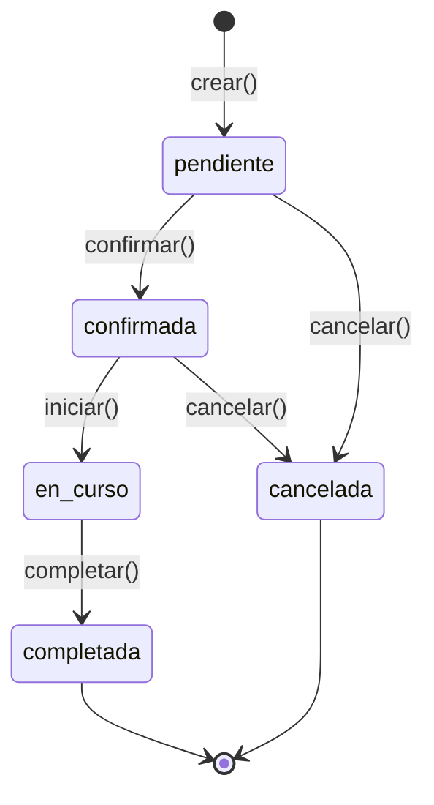
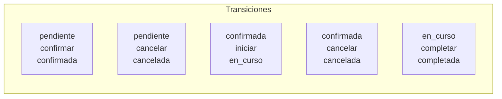
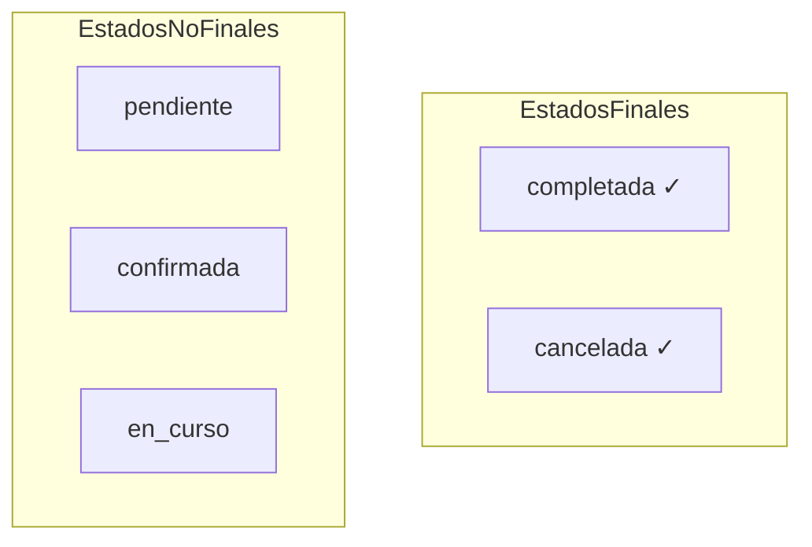
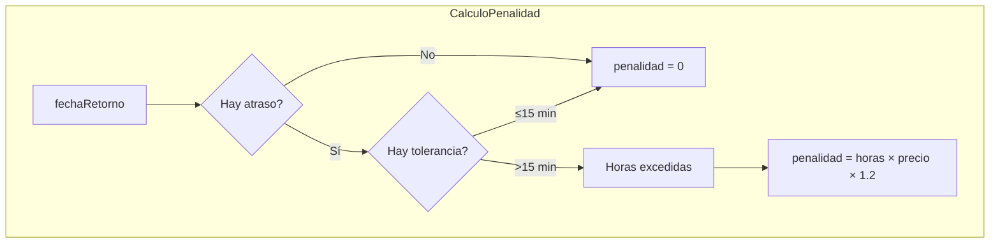

# Máquina de Estados - Reservas

## Diagrama de Estados



## Estados

| Estado | Valor | Descripción |
|--------|-------|-------------|
| `PENDIENTE` | `'pendiente'` | Reservada, esperando confirmación |
| `CONFIRMADA` | `'confirmada'` | Confirmada, lista para iniciar |
| `EN_CURSO` | `'en_curso'` | El auto está en uso |
| `COMPLETADA` | `'completada'` | Alquiler finalizado |
| `CANCELADA` | `'cancelada'` | Reserva cancelada |

## Transiciones



| Desde | Evento | Hacia |
|-------|--------|-------|
| `pendiente` | `confirmar` | `confirmada` |
| `pendiente` | `cancelar` | `cancelada` |
| `confirmada` | `iniciar` | `en_curso` |
| `confirmada` | `cancelar` | `cancelada` |
| `en_curso` | `completar` | `completada` |

## Estados Finales



| Estado Final | ¿Se puede modificar? | ¿Se puede cancelar? |
|--------------|----------------------|---------------------|
| `COMPLETADA` | No | No |
| `CANCELADA` | No | No |

## Implementación

### Constants

```typescript
// reserva.constants.ts
export const ESTADOS_RESERVA = {
    PENDIENTE: 'pendiente',
    CONFIRMADA: 'confirmada',
    EN_CURSO: 'en_curso',
    COMPLETADA: 'completada',
    CANCELADA: 'cancelada',
} as const;

export type EstadoReserva = (typeof ESTADOS_RESERVA)[keyof typeof ESTADOS_RESERVA];

export const PENALIDAD = {
    TOLERANCIA_MINUTOS: 15,
    MULTIPLICADOR: 1.2,
} as const;
```

### State Machine Class

```typescript
// reserva.state-machine.ts
export type EventoReserva = 'confirmar' | 'iniciar' | 'completar' | 'cancelar';

export interface TransicionEstado {
    desde: EstadoReserva;
    evento: EventoReserva;
    hacia: EstadoReserva;
}

export const TRANSICIONES_RESERVA: TransicionEstado[] = [
    { desde: ESTADOS_RESERVA.PENDIENTE, evento: 'confirmar', hacia: ESTADOS_RESERVA.CONFIRMADA },
    { desde: ESTADOS_RESERVA.PENDIENTE, evento: 'cancelar', hacia: ESTADOS_RESERVA.CANCELADA },
    { desde: ESTADOS_RESERVA.CONFIRMADA, evento: 'iniciar', hacia: ESTADOS_RESERVA.EN_CURSO },
    { desde: ESTADOS_RESERVA.CONFIRMADA, evento: 'cancelar', hacia: ESTADOS_RESERVA.CANCELADA },
    { desde: ESTADOS_RESERVA.EN_CURSO, evento: 'completar', hacia: ESTADOS_RESERVA.COMPLETADA },
];

export const ESTADOS_FINALES: EstadoReserva[] = [
    ESTADOS_RESERVA.COMPLETADA,
    ESTADOS_RESERVA.CANCELADA,
];

export class MaquinaEstadosReserva {
    private transiciones: Map<string, EstadoReserva>;

    constructor(transiciones: TransicionEstado[]) {
        this.transiciones = new Map();
        transiciones.forEach((t) => {
            this.transiciones.set(`${t.desde}:${t.evento}`, t.hacia);
        });
    }

    puedeTransicionar(estadoActual: EstadoReserva, evento: EventoReserva): boolean {
        return this.transiciones.has(`${estadoActual}:${evento}`);
    }

    transicionar(estadoActual: EstadoReserva, evento: EventoReserva): EstadoReserva {
        const clave = `${estadoActual}:${evento}`;
        const nuevoEstado = this.transiciones.get(clave);

        if (!nuevoEstado) {
            const transicionesValidas = this.obtenerTransicionesValidas(estadoActual);
            throw new Error(
                `Transición inválida: no se puede '${evento}' desde '${estadoActual}'. ` +
                    `Transiciones válidas: ${transicionesValidas.length > 0 ? transicionesValidas.join(', ') : 'ninguna'}`,
            );
        }

        return nuevoEstado;
    }

    obtenerTransicionesValidas(estadoActual: EstadoReserva): EventoReserva[] {
        const eventos: EventoReserva[] = [];
        this.transiciones.forEach((_, clave) => {
            const [estado, evento] = clave.split(':') as [EstadoReserva, EventoReserva];
            if (estado === estadoActual) {
                eventos.push(evento);
            }
        });
        return eventos;
    }

    esEstadoFinal(estado: EstadoReserva): boolean {
        return ESTADOS_FINALES.includes(estado);
    }
}

export const maquinaEstadosReserva = new MaquinaEstadosReserva(TRANSICIONES_RESERVA);
```

### Uso en Entidad Reserva

```typescript
// reserva.entity.ts
export class Reserva {
    // ... propiedades ...

    private transitions(evento: EventoReserva): void {
        this._estado = maquinaEstadosReserva.transicionar(this._estado, evento);
        this._updatedAt = new Date();
    }

    confirmar(): void {
        this.transitions('confirmar');
    }

    iniciar(): void {
        this.transitions('iniciar');
    }

    completar(fechaRetorno: Date, penalidad: number | null = null): void {
        this.transitions('completar');
        this._fechaRetorno = fechaRetorno;
        this._penalidad = penalidad;
    }

    cancelar(): void {
        this.transitions('cancelar');
    }

    actualizarFechasYPrecio(fechaInicio: Date, fechaFin: Date, precioTotal: number): void {
        if (maquinaEstadosReserva.esEstadoFinal(this._estado)) {
            throw new Error('No se puede modificar una reserva completada o cancelada');
        }
        // ... actualización ...
    }
}
```

## Penalidades por Atraso



### Reglas

| Condición | Penalidad |
|-----------|-----------|
| Retorno ≤ 15 min tarde | Sin cargo (0) |
| Retorno > 15 min tarde | 120% del precio por hora × horas excedidas |

### Ejemplo de Cálculo

```typescript
const reserva = new Reserva({ ... });

// Suponiendo:
// - precioPorHora = 1000
// - fechaFin = 2026-04-12T10:00:00
// - fechaRetorno = 2026-04-12T12:00:00 (2 horas tarde)

const penalidad = reserva.calcularPenalidad(
    new Date('2026-04-12T12:00:00'),
    1000  // precio por hora
);

// Cálculo:
// diffMinutes = 120
// horasExcedidas = ceil(120 / 60) = 2
// penalidad = 2 × 1000 × 1.2 = 2400
```

## Verificación de Solapamiento

```typescript
// Dos reservas se solapan si:
// - La nueva reserva inicia antes de que termine la existente Y
// - La nueva reserva termina después de que inicie la existente

reserva.seSolapaCon(otraFechaInicio: Date, otraFechaFin: Date): boolean {
    return (
        !maquinaEstadosReserva.esEstadoFinal(this._estado) &&
        this._fechaInicio < otraFechaFin &&
        this._fechaFin > otraFechaInicio
    );
}
```
