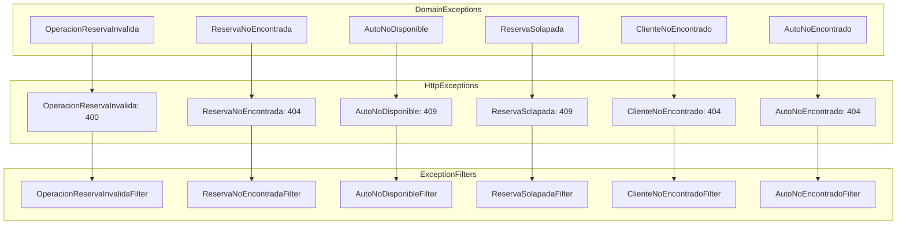
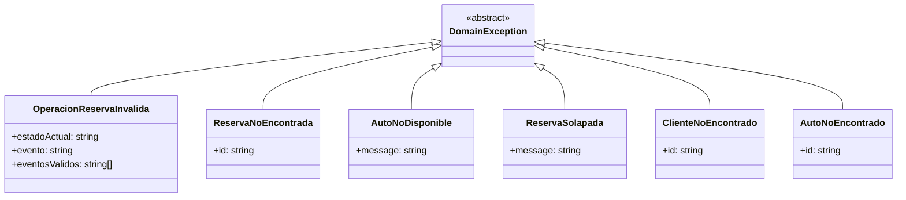
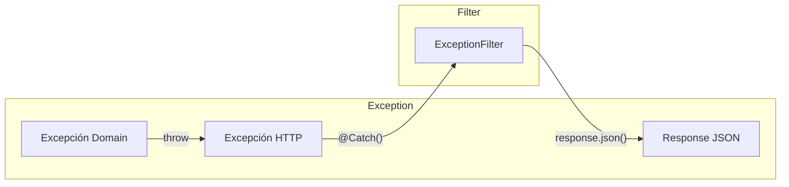

# Excepciones y Filtros

## Arquitectura de Excepciones



## Excepciones de Dominio



### Excepciones

| Exception | Propósito | Ejemplo de Uso |
|-----------|-----------|----------------|
| `OperacionReservaInvalida` | Transición de estado inválida | `confirmar()` desde `completada` |
| `ReservaNoEncontrada` | Reserva no existe | `obtenerPorId(id)` devuelve null |
| `AutoNoDisponible` | Auto no disponible | Intentar crear reserva con auto desactivado |
| `ReservaSolapada` | Fechas se solapan | Reserva existente para mismas fechas |
| `ClienteNoEncontrado` | Cliente no existe | `obtenerPorId(id)` devuelve null |
| `AutoNoEncontrado` | Auto no existe | `obtenerPorId(id)` devuelve null |

## Código de Dominio

```typescript
// src/domain/exceptions/reserva.exceptions.ts

export class OperacionReservaInvalida extends Error {
    constructor(
        public readonly estadoActual: string,
        public readonly evento: string,
        public readonly eventosValidos: string[],
    ) {
        super(
            `No se puede '${evento}' desde el estado '${estadoActual}'. Acciones válidas: ${eventosValidos.join(', ')}`,
        );
        this.name = 'OperacionReservaInvalida';
    }
}

export class ReservaNoEncontrada extends Error {
    constructor(public readonly id: string) {
        super(`Reserva con id '${id}' no encontrada`);
        this.name = 'ReservaNoEncontrada';
    }
}

export class AutoNoDisponible extends Error {
    constructor(message: string) {
        super(message);
        this.name = 'AutoNoDisponible';
    }
}

export class ReservaSolapada extends Error {
    constructor(message: string) {
        super(message);
        this.name = 'ReservaSolapada';
    }
}

export class ClienteNoEncontrado extends Error {
    constructor(public readonly id: string) {
        super(`Cliente con id '${id}' no encontrado`);
        this.name = 'ClienteNoEncontrado';
    }
}

export class AutoNoEncontrado extends Error {
    constructor(public readonly id: string) {
        super(`Auto con id '${id}' no encontrado`);
        this.name = 'AutoNoEncontrado';
    }
}
```

## Excepciones HTTP

Cada excepción de dominio tiene una对应的 excepción HTTP:

```typescript
// src/infrastructure/exceptions/reserva.exception-filters.ts

export class OperacionReservaInvalida extends HttpException {
    constructor(message: string) {
        super(
            { statusCode: HttpStatus.BAD_REQUEST, error: 'Operación Inválida', message },
            HttpStatus.BAD_REQUEST,
        );
    }
}

export class ReservaNoEncontrada extends HttpException {
    constructor(id: string) {
        super(
            { statusCode: HttpStatus.NOT_FOUND, error: 'Reserva No Encontrada', message: `Reserva con id '${id}' no encontrada` },
            HttpStatus.NOT_FOUND,
        );
    }
}

export class AutoNoDisponible extends HttpException {
    constructor(message: string) {
        super(
            { statusCode: HttpStatus.CONFLICT, error: 'Auto No Disponible', message },
            HttpStatus.CONFLICT,
        );
    }
}

export class ReservaSolapada extends HttpException {
    constructor(message: string) {
        super(
            { statusCode: HttpStatus.CONFLICT, error: 'Reserva Solapada', message },
            HttpStatus.CONFLICT,
        );
    }
}

export class ClienteNoEncontrado extends HttpException {
    constructor(id: string) {
        super(
            { statusCode: HttpStatus.NOT_FOUND, error: 'Cliente No Encontrado', message: `Cliente con id '${id}' no encontrado` },
            HttpStatus.NOT_FOUND,
        );
    }
}

export class AutoNoEncontrado extends HttpException {
    constructor(id: string) {
        super(
            { statusCode: HttpStatus.NOT_FOUND, error: 'Auto No Encontrado', message: `Auto con id '${id}' no encontrado` },
            HttpStatus.NOT_FOUND,
        );
    }
}
```

## Filtros de Excepción



### Implementación de Filtros

```typescript
@Catch(OperacionReservaInvalida)
export class OperacionReservaInvalidaFilter implements ExceptionFilter {
    catch(exception: OperacionReservaInvalida, host: ArgumentsHost) {
        const ctx = host.switchToHttp();
        const response = ctx.getResponse<Response>();
        response.status(HttpStatus.BAD_REQUEST).json(exception.getResponse());
    }
}

@Catch(ReservaNoEncontrada)
export class ReservaNoEncontradaFilter implements ExceptionFilter {
    catch(exception: ReservaNoEncontrada, host: ArgumentsHost) {
        const ctx = host.switchToHttp();
        const response = ctx.getResponse<Response>();
        response.status(HttpStatus.NOT_FOUND).json(exception.getResponse());
    }
}

@Catch(AutoNoDisponible)
export class AutoNoDisponibleFilter implements ExceptionFilter {
    catch(exception: AutoNoDisponible, host: ArgumentsHost) {
        const ctx = host.switchToHttp();
        const response = ctx.getResponse<Response>();
        response.status(HttpStatus.CONFLICT).json(exception.getResponse());
    }
}

@Catch(ReservaSolapada)
export class ReservaSolapadaFilter implements ExceptionFilter {
    catch(exception: ReservaSolapada, host: ArgumentsHost) {
        const ctx = host.switchToHttp();
        const response = ctx.getResponse<Response>();
        response.status(HttpStatus.CONFLICT).json(exception.getResponse());
    }
}

@Catch(ClienteNoEncontrado)
export class ClienteNoEncontradoFilter implements ExceptionFilter {
    catch(exception: ClienteNoEncontrado, host: ArgumentsHost) {
        const ctx = host.switchToHttp();
        const response = ctx.getResponse<Response>();
        response.status(HttpStatus.NOT_FOUND).json(exception.getResponse());
    }
}

@Catch(AutoNoEncontrado)
export class AutoNoEncontradoFilter implements ExceptionFilter {
    catch(exception: AutoNoEncontrado, host: ArgumentsHost) {
        const ctx = host.switchToHttp();
        const response = ctx.getResponse<Response>();
        response.status(HttpStatus.NOT_FOUND).json(exception.getResponse());
    }
}
```

## Registro de Filtros Globales

```typescript
// src/main.ts
app.useGlobalFilters(
    new OperacionReservaInvalidaFilter(),
    new ReservaNoEncontradaFilter(),
    new AutoNoDisponibleFilter(),
    new ReservaSolapadaFilter(),
    new ClienteNoEncontradoFilter(),
    new AutoNoEncontradoFilter(),
);
```

## Respuestas de Error

### Error 400 - Bad Request

```json
{
    "statusCode": 400,
    "error": "Operación Inválida",
    "message": "No se puede 'confirmar' desde el estado 'completada'. Acciones válidas: ninguna"
}
```

### Error 404 - Not Found

```json
{
    "statusCode": 404,
    "error": "Reserva No Encontrada",
    "message": "Reserva con id 'abc-123' no encontrada"
}
```

### Error 409 - Conflict

```json
{
    "statusCode": 409,
    "error": "Auto No Disponible",
    "message": "El auto no está disponible para alquiler"
}
```

```json
{
    "statusCode": 409,
    "error": "Reserva Solapada",
    "message": "Ya existe una reserva que se solapa con las fechas ingresadas"
}
```

## Mapa de Códigos HTTP

| HTTP Code | Excepción | Uso Común |
|-----------|-----------|-----------|
| `400` | `OperacionReservaInvalida` | Transición de estado inválida |
| `404` | `ReservaNoEncontrada` | Reserva no existe |
| `404` | `ClienteNoEncontrado` | Cliente no existe |
| `404` | `AutoNoEncontrado` | Auto no existe |
| `409` | `AutoNoDisponible` | Auto no disponible para alquiler |
| `409` | `ReservaSolapada` | Fechas de reserva se solapan |
