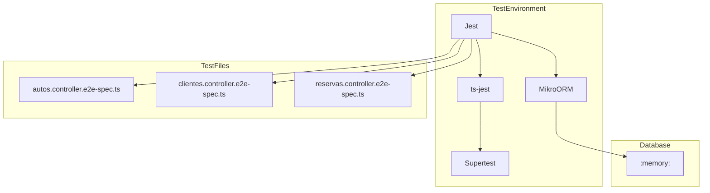
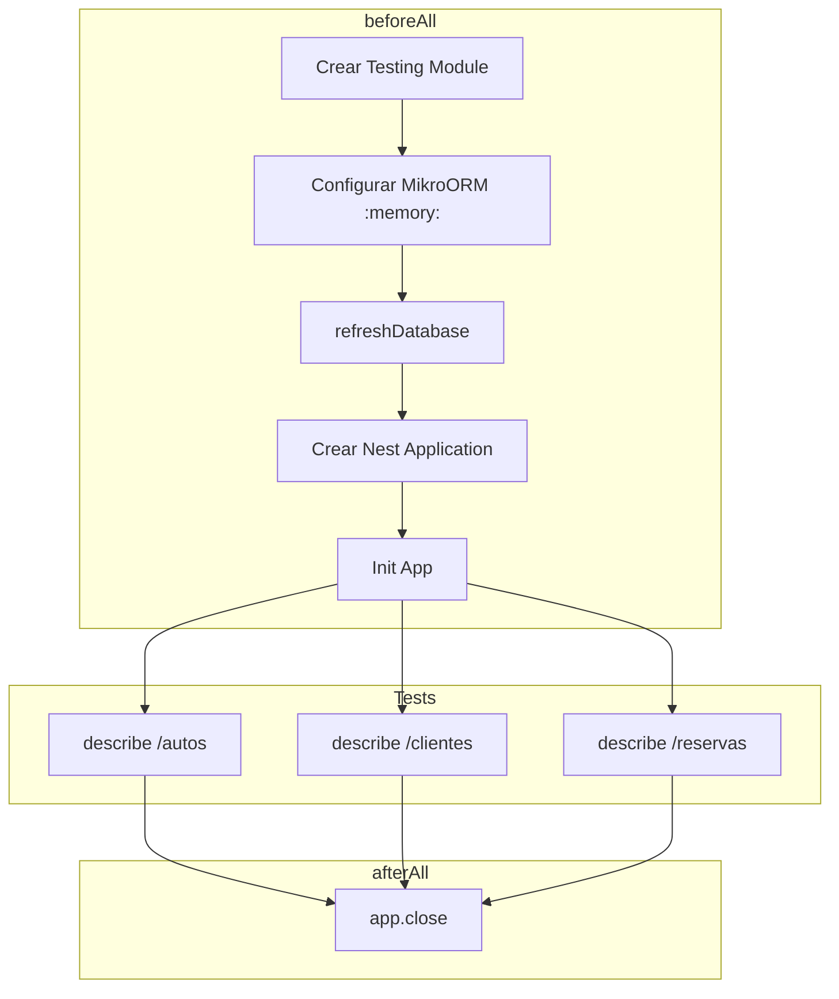

# Testing - Guía de Pruebas E2E

## Configuración



## jest-e2e.js

```javascript
module.exports = {
  preset: 'ts-jest',
  testEnvironment: 'node',
  rootDir: '..',
  testMatch: ['<rootDir>/test/**/*.e2e-spec.ts'],
  moduleFileExtensions: ['ts', 'tsx', 'js', 'json', 'd.ts'],
  collectCoverageFrom: ['<rootDir>/src/**/*.ts'],
  coverageDirectory: '<rootDir>/coverage',
  moduleNameMapper: {
    '^src/(.*)$': '<rootDir>/src/$1',
    '^uuid$': '<rootDir>/node_modules/uuid/dist/cjs/index.js',
  },
  transform: {
    '^.+\\.tsx?$': ['ts-jest', {
      tsconfig: '<rootDir>/tsconfig.json',
      isolatedModules: true,
    }],
  },
};
```

## Estructura de Tests



## Configuración de Módulo de Test

```typescript
beforeAll(async () => {
    const moduleFixture: TestingModule = await Test.createTestingModule({
        imports: [
            MikroOrmModule.forRoot({
                driver: SqliteDriver,
                dbName: ':memory:',
                entities: [AutoEntity, ClienteEntity, ReservaEntity],
                allowGlobalContext: true,
            }),
            AlquilerAutosModule,
        ],
    }).compile();

    const orm = moduleFixture.get(MikroORM);
    await orm.schema.refreshDatabase();

    app = moduleFixture.createNestApplication();
    app.useGlobalPipes(
        new ValidationPipe({
            whitelist: true,
            forbidNonWhitelisted: true,
            transform: true,
            transformOptions: {
                enableImplicitConversion: true,
            },
        }),
    );

    await app.init();
});
```

## Tests de Autos

```typescript
describe('Autos Controller (e2e)', () => {
    let app: INestApplication;
    let autoId: string;

    beforeAll(async () => { /* setup */ });

    describe('/autos (POST)', () => {
        it('debe crear un auto correctamente', () => {
            return request(app.getHttpServer())
                .post('/autos')
                .send({
                    marca: 'Toyota',
                    modelo: 'Corolla',
                    anio: 2023,
                    patente: 'ABC123',
                    precioPorHora: 1000,
                })
                .expect(201)
                .then((response) => {
                    expect(response.body).toHaveProperty('id');
                    expect(response.body.marca).toBe('Toyota');
                    autoId = response.body.id;
                });
        });

        it('debe rechazar auto con patente duplicada', async () => {
            await request(app.getHttpServer())
                .post('/autos')
                .send({ patente: 'ABC123', ... })
                .expect(400);
        });
    });

    describe('/autos (GET)', () => {
        it('debe listar todos los autos', () => {
            return request(app.getHttpServer())
                .get('/autos')
                .expect(200)
                .then((response) => {
                    expect(response.body).toHaveProperty('autos');
                    expect(Array.isArray(response.body.autos)).toBe(true);
                });
        });
    });

    // ... más tests
});
```

## Tests de Clientes

```typescript
describe('Clientes Controller (e2e)', () => {
    let app: INestApplication;
    let clienteId: string;

    beforeAll(async () => { /* setup */ });

    describe('/clientes (POST)', () => {
        it('debe crear un cliente correctamente', () => {
            return request(app.getHttpServer())
                .post('/clientes')
                .send({
                    nombre: 'Juan',
                    apellido: 'Pérez',
                    dni: '12345678',
                    email: 'juan@email.com',
                    telefono: '11-1234-5678',
                })
                .expect(201)
                .then((response) => {
                    expect(response.body.nombre).toBe('Juan');
                    clienteId = response.body.id;
                });
        });
    });

    describe('/clientes (GET)', () => {
        it('debe listar todos los clientes', () => {
            return request(app.getHttpServer())
                .get('/clientes')
                .expect(200)
                .then((response) => {
                    expect(response.body).toHaveProperty('clientes');
                });
        });
    });
});
```

## Tests de Reservas

```typescript
describe('Reservas Controller (e2e)', () => {
    let app: INestApplication;
    let autoId: string;
    let clienteId: string;
    let reservaId: string;

    beforeAll(async () => { /* setup */ });

    describe('/reservas (POST)', () => {
        it('debe crear una reserva correctamente', async () => {
            // 1. Crear auto
            const autoResponse = await request(app.getHttpServer())
                .post('/autos')
                .send({ marca: 'Toyota', patente: 'ABC123', ... });
            autoId = autoResponse.body.id;

            // 2. Crear cliente
            const clienteResponse = await request(app.getHttpServer())
                .post('/clientes')
                .send({ nombre: 'Juan', dni: '12345678', ... });
            clienteId = clienteResponse.body.id;

            // 3. Crear reserva
            return request(app.getHttpServer())
                .post('/reservas')
                .send({
                    autoId,
                    clienteId,
                    fechaInicio: tomorrow,
                    fechaFin: dayAfter,
                    precioTotal: 5000,
                })
                .expect(201)
                .then((response) => {
                    expect(response.body.estado).toBe('pendiente');
                    reservaId = response.body.id;
                });
        });
    });

    describe('Transiciones de estado', () => {
        it('debe confirmar una reserva pendiente', () => {
            return request(app.getHttpServer())
                .post(`/reservas/${reservaId}/confirmar`)
                .expect(201)
                .then((response) => {
                    expect(response.body.estado).toBe('confirmada');
                });
        });

        it('debe iniciar una reserva confirmada', () => {
            return request(app.getHttpServer())
                .post(`/reservas/${reservaId}/iniciar`)
                .expect(201)
                .then((response) => {
                    expect(response.body.estado).toBe('en_curso');
                });
        });

        it('debe devolver un auto de reserva en curso', () => {
            return request(app.getHttpServer())
                .post(`/reservas/${reservaId}/devolver`)
                .send({ fechaRetorno: new Date().toISOString() })
                .expect(201)
                .then((response) => {
                    expect(response.body.estado).toBe('completada');
                });
        });
    });
});
```

## Estados de Respuesta

| Estado | Valor | Descripción |
|--------|-------|-------------|
| `pendiente` | `'pendiente'` | Reserva creada |
| `confirmada` | `'confirmada'` | Reserva confirmada |
| `en_curso` | `'en_curso'` | Auto en uso |
| `completada` | `'completada'` | Alquiler finalizado |
| `cancelada` | `'cancelada'` | Reserva cancelada |

## Ejecución de Tests

```bash
# Todos los tests E2E
npm run test:e2e

# Solo un archivo
npx jest --config ./test/jest-e2e.js --testPathPattern=autos

# Con coverage
npm run test:cov
```

## Resultados

```
PASS test/autos.controller.e2e-spec.ts
  Autos Controller (e2e)
    /autos (POST)
      ✓ debe crear un auto correctamente
      ✓ debe rechazar auto con patente duplicada
      ✓ debe rechazar auto con datos inválidos
    /autos (GET)
      ✓ debe listar todos los autos
      ...

PASS test/clientes.controller.e2e-spec.ts
PASS test/reservas.controller.e2e-spec.ts

Test Suites: 3 passed, 3 total
Tests:       27 passed, 27 total
```

## Notas Importantes

1. **Base de datos en memoria**: Cada test usa `:memory:` SQLite
2. **Schema refresh**: `orm.schema.refreshDatabase()` recrea las tablas
3. **Auto cleanup**: `afterAll` cierra la aplicación
4. **IDs únicos**: Los IDs son UUIDs generados en cada ejecución
5. **Fechas relativas**: Usar fechas futuras para reservas (`setDate(getDate() + 1)`)
