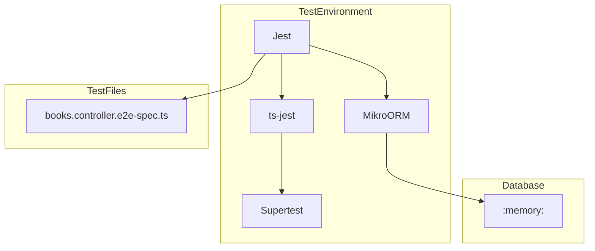
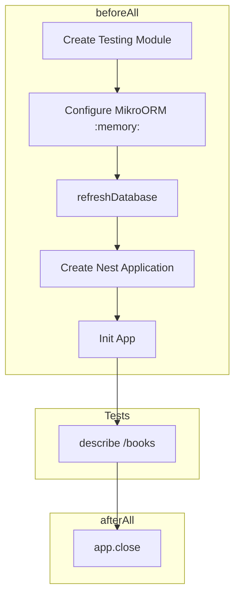

# Testing - E2E Testing Guide

## Configuration



## jest-e2e.js

```javascript
module.exports = {
  preset: 'ts-jest',
  testEnvironment: 'node',
  rootDir: '..',
  testMatch: ['<rootDir>/test/**/*.e2e-spec.ts'],
  moduleFileExtensions: ['ts', 'tsx', 'js', 'json', 'd.ts'],
  collectCoverageFrom: ['<rootDir>/src/**/*.ts'],
  coverageDirectory: '<rootDir>/coverage',
  moduleNameMapper: {
    '^src/(.*)$': '<rootDir>/src/$1',
    '^uuid$': '<rootDir>/node_modules/uuid/dist/cjs/index.js',
  },
  transform: {
    '^.+\\.tsx?$': ['ts-jest', {
      tsconfig: '<rootDir>/tsconfig.json',
      isolatedModules: true,
    }],
  },
};
```

## Test Structure



## Test Module Configuration

```typescript
beforeAll(async () => {
    const moduleFixture: TestingModule = await Test.createTestingModule({
        imports: [
            MikroOrmModule.forRoot({
                driver: SqliteDriver,
                dbName: ':memory:',
                entities: [BookEntity],
                allowGlobalContext: true,
            }),
            BooksModule,
        ],
    }).compile();

    const orm = moduleFixture.get(MikroORM);
    await orm.schema.refreshDatabase();

    app = moduleFixture.createNestApplication();
    app.useGlobalPipes(
        new ValidationPipe({
            whitelist: true,
            forbidNonWhitelisted: true,
            transform: true,
            transformOptions: {
                enableImplicitConversion: true,
            },
        }),
    );

    await app.init();
});
```

## Books Tests

```typescript
describe('Books Controller (e2e)', () => {
    let app: INestApplication;
    let bookId: string;

    beforeAll(async () => { /* setup */ });

    describe('/books (POST)', () => {
        it('should create a book', () => {
            return request(app.getHttpServer())
                .post('/books')
                .send({
                    title: 'Clean Architecture',
                    author: 'Robert C. Martin',
                    isbn: '978-0-13-468599-1',
                    publicationYear: 2017,
                    genre: 'Software Engineering',
                })
                .expect(201)
                .then((response) => {
                    expect(response.body).toHaveProperty('id');
                    expect(response.body.title).toBe('Clean Architecture');
                    bookId = response.body.id;
                });
        });

        it('should reject a book with duplicate ISBN', async () => {
            await request(app.getHttpServer())
                .post('/books')
                .send({
                    title: 'Another Book',
                    author: 'Someone',
                    isbn: '978-0-13-468599-1',
                    publicationYear: 2020,
                })
                .expect(400);
        });
    });

    describe('/books (GET)', () => {
        it('should list all books', () => {
            return request(app.getHttpServer())
                .get('/books')
                .expect(200)
                .then((response) => {
                    expect(response.body).toHaveProperty('books');
                    expect(Array.isArray(response.body.books)).toBe(true);
                });
        });
    });

    describe('/books/:id (GET)', () => {
        it('should return a book by ID', () => {
            return request(app.getHttpServer())
                .get(`/books/${bookId}`)
                .expect(200)
                .then((response) => {
                    expect(response.body.id).toBe(bookId);
                });
        });

        it('should return 404 for unknown ID', () => {
            return request(app.getHttpServer())
                .get('/books/non-existent-id')
                .expect(404);
        });
    });

    describe('/books/:id (PUT)', () => {
        it('should update a book', () => {
            return request(app.getHttpServer())
                .put(`/books/${bookId}`)
                .send({ title: 'Updated Title' })
                .expect(200)
                .then((response) => {
                    expect(response.body.title).toBe('Updated Title');
                });
        });
    });

    describe('/books/:id (DELETE)', () => {
        it('should delete a book', () => {
            return request(app.getHttpServer())
                .delete(`/books/${bookId}`)
                .expect(204);
        });
    });
});
```

## Running Tests

```bash
# All E2E tests
pnpm test:e2e

# Single file
npx jest --config ./test/jest-e2e.js --testPathPattern=books

# With coverage
pnpm test:cov
```

## Important Notes

1. **In-memory database**: Each test run uses SQLite `:memory:`
2. **Schema refresh**: `orm.schema.refreshDatabase()` recreates tables before tests
3. **Auto cleanup**: `afterAll` closes the application
4. **Unique IDs**: IDs are UUIDs generated on each run
