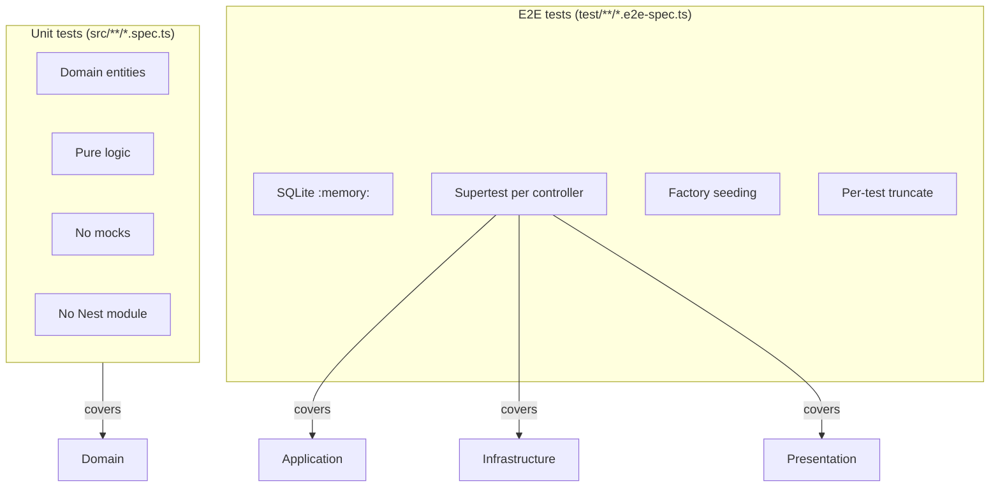
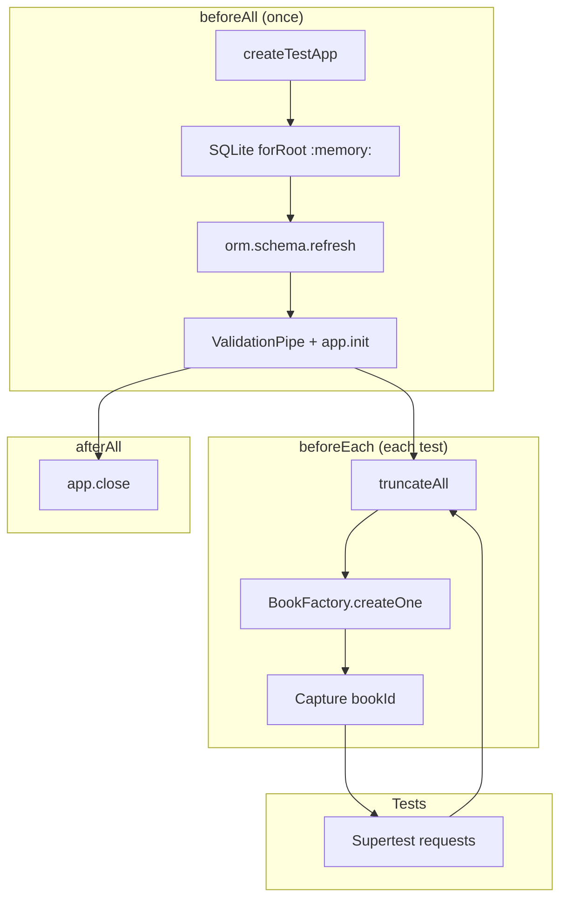

# Testing - Unit and E2E Testing Guide

## Two Test Layers


```mermaid
graph TB
    subgraph Unit["Unit tests (src/**/*.spec.ts)"]
        U1[Domain entities]
        U2[Pure logic]
        U3[No mocks]
        U4[No Nest module]
    end

    subgraph E2E["E2E tests (test/**/*.e2e-spec.ts)"]
        E1[SQLite :memory:]
        E2[Supertest per controller]
        E3[Factory seeding]
        E4[Per-test truncate]
    end

    Unit -->|covers| Domain
    E2 -->|covers| Application
    E2 -->|covers| Infrastructure
    E2 -->|covers| Presentation
```

Unit tests verify pure domain logic in isolation; E2E tests exercise the full
HTTP stack on an in-memory SQLite database. Neither layer needs PostgreSQL.

## Configuration

```mermaid
graph TB
    subgraph TestEnvironment
        JEST[Jest 30]
        SWC[SWC / @swc/jest]
        SUPER[Supertest]
        MIKRO[MikroORM 7]
        FAKER[Faker]
        SEEDER[@mikro-orm/seeder]
    end

    subgraph Database
        SQLITE[(SQLite :memory:)]
    end

    subgraph TestFiles
        UNIT[base.entity.spec.ts]
        BOOKSPEC[book.entity.spec.ts]
        E2E[books.e2e-spec.ts]
    end

    JEST --> SWC
    JEST --> SUPER
    SUPER --> MIKRO
    MIKRO --> SQLITE
    SEEDER --> FAKER
    JEST --> UNIT
    JEST --> BOOKSPEC
    JEST --> E2E
```

## jest.config.js (unit)

```javascript
module.exports = {
  preset: 'ts-jest',
  testEnvironment: 'node',
  rootDir: '.',
  testMatch: ['<rootDir>/src/**/*.spec.ts'],
  testPathIgnorePatterns: ['/node_modules/', '/.claude/'],
  moduleFileExtensions: ['ts', 'tsx', 'js', 'jsx', 'json', 'd.ts'],
  collectCoverageFrom: ['<rootDir>/src/**/*.ts'],
  coverageDirectory: '<rootDir>/coverage/unit',
  coverageReporters: ['text', 'lcov', 'html'],
  coveragePathIgnorePatterns: [
    '/node_modules/',
    '<rootDir>/src/main.ts',
    '<rootDir>/src/app.module.ts',
    '<rootDir>/src/books.module.ts',
    '<rootDir>/src/application/',
    '<rootDir>/src/infrastructure/',
    '<rootDir>/src/presentation/',
  ],
  coverageThreshold: {
    global: { lines: 60, functions: 60, branches: 50, statements: 60 },
  },
  moduleNameMapper: {
    '^src/(.*)$': '<rootDir>/src/$1',
  },
  transform: {
    '^.+\\.(ts|tsx|js|jsx)$': ['@swc/jest', {
      jsc: {
        parser: { syntax: 'typescript', decorators: true },
        target: 'es2021',
        transform: {
          legacyDecorator: true,
          decoratorMetadata: true,
        },
      },
      module: { type: 'commonjs' },
    }],
  },
  transformIgnorePatterns: ['/node_modules/(?!.*(@mikro-orm|kysely|uuid|@faker-js))'],
};
```

Unit coverage is scoped to `src/domain/entities/` only. The other layers
(application, infrastructure, presentation) are excluded from unit coverage
because they are exercised by the E2E suite.

## test/jest-e2e.js (e2e)

```javascript
module.exports = {
  preset: 'ts-jest',
  testEnvironment: 'node',
  rootDir: '..',
  testMatch: ['<rootDir>/test/**/*.e2e-spec.ts'],
  testPathIgnorePatterns: ['/node_modules/', '/.claude/'],
  moduleFileExtensions: ['ts', 'tsx', 'js', 'json', 'd.ts'],
  collectCoverageFrom: ['<rootDir>/src/**/*.ts'],
  coverageDirectory: '<rootDir>/coverage/e2e',
  coverageReporters: ['text', 'lcov', 'html'],
  coveragePathIgnorePatterns: ['/node_modules/', '<rootDir>/src/main.ts', '\\.spec\\.ts$'],
  coverageThreshold: {
    global: { lines: 60, functions: 60, branches: 50, statements: 60 },
  },
  moduleNameMapper: {
    '^src/(.*)$': '<rootDir>/src/$1',
  },
  transform: {
    '^.+\\.(ts|tsx|js|jsx)$': ['@swc/jest', {
      jsc: {
        parser: { syntax: 'typescript', decorators: true },
        target: 'es2021',
        transform: {
          legacyDecorator: true,
          decoratorMetadata: true,
        },
      },
      module: { type: 'commonjs' },
    }],
  },
  transformIgnorePatterns: ['/node_modules/(?!.*(@mikro-orm|kysely|uuid|@faker-js))'],
};
```

## E2E Architecture


```mermaid
graph TD
    subgraph beforeAll["beforeAll (once)"]
        A1[createTestApp]
        A2[SQLite forRoot :memory:]
        A3[orm.schema.refresh]
        A4[ValidationPipe + app.init]
    end

    subgraph beforeEach["beforeEach (each test)"]
        B1[truncateAll]
        B2[BookFactory.createOne]
        B3[Capture bookId]
    end

    subgraph Tests
        C1[Supertest requests]
    end

    subgraph afterAll
        D1[app.close]
    end

    A1 --> A2 --> A3 --> A4
    A4 --> B1
    B1 --> B2 --> B3
    B3 --> C1
    C1 --> B1
    A4 --> D1
```

`createTestApp()` (in `test/helpers/app.helper.ts`) builds a Nest app backed
by an in-memory SQLite `MikroORM` and refreshes the schema once. Between tests,
`truncateAll(orm)` clears all rows, then the factory seeds a known record
directly into the database — not through HTTP.

### Test module setup

```typescript
import { createTestApp } from './helpers/app.helper';
import { truncateAll } from './helpers/database.helper';
import { BooksModule } from '../src/books.module';
import { BookEntitySchema } from '../src/infrastructure/database/postgres/entities/book.entity';
import { BookFactory } from '../src/infrastructure/database/postgres/factories/book.factory';

describe('Books Controller (e2e)', () => {
  let app: INestApplication;
  let orm: MikroORM;
  let bookId: string;

  beforeAll(async () => {
    ({ app, orm } = await createTestApp(BooksModule, [BookEntitySchema]));
  });

  afterAll(async () => {
    await app.close();
  });

  beforeEach(async () => {
    await truncateAll(orm);
    const book = await new BookFactory(orm.em).createOne({
      title: 'The Pragmatic Programmer',
      author: 'Andrew Hunt',
      isbn: '978-0135957059',
      publicationYear: 1999,
      genre: 'Software Engineering',
    });
    bookId = book.id;
  });
});
```

## Unit Test Pattern

Unit tests are pure `import` + `expect` — no Nest `TestingModule`, no
providers array, no mocks. They cover the domain layer directly.

```typescript
import { Book } from './book.entity';

describe('Book', () => {
  it('creates a book with generated UUIDv7 and timestamps', () => {
    const book = Book.create({
      title: 'Clean Architecture',
      author: 'Robert C. Martin',
      isbn: '978-0-13-468599-1',
      publicationYear: 2017,
      genre: 'Software Engineering',
    });

    expect(book.id).toMatch(/^[0-9a-f-]+-7[0-9a-f-]+$/); // UUIDv7
    expect(book.createdAt).toBeInstanceOf(Date);
    expect(book.updatedAt).toEqual(book.createdAt);
  });

  it('updates title and bumps updatedAt', async () => {
    const book = Book.create({ /* ... */ });
    await new Promise((r) => setTimeout(r, 5));
    book.updateTitle('New');
    expect(book.updatedAt.getTime()).toBeGreaterThan(book.createdAt.getTime());
  });
});
```

- `src/domain/entities/base.entity.spec.ts` — 7 tests: UUIDv7 generation,
  timestamp equality, `touch()` advancing `updatedAt`, `id`/`createdAt`
  immutability.
- `src/domain/entities/book.entity.spec.ts` — 8 tests: `create`,
  `reconstruct`, `updateTitle`/`updateAuthor`/`updatePublicationYear`/
  `updateGenre`, genre `null` edge cases.

## Factory Pattern

Factories live in `src/infrastructure/database/postgres/factories/` and extend
MikroORM's `Factory<T>`:

```typescript
import { faker } from '@faker-js/faker';
import { Factory } from '@mikro-orm/seeder';
import { BookEntity } from '../entities/book.entity';

export class BookFactory extends Factory<BookEntity> {
  model = BookEntity;

  definition(): Partial<BookEntity> {
    return {
      title: faker.book.title(),
      author: faker.person.fullName(),
      isbn: faker.commerce.isbn(),
      publicationYear: faker.number.int({ min: 1900, max: 2025 }),
      genre: faker.book.genre(),
    };
  }
}
```

| Method                  | Async? | Persists? | Use                                  |
|-------------------------|--------|-----------|--------------------------------------|
| `makeOne(overrides)`     | No     | No        | In-memory entity, flush manually     |
| `createOne(overrides)`  | Yes    | Yes       | Seed straight into the DB            |
| `each(overrides, n)`    | Yes    | Yes       | Multiple related records             |

Override any field by passing a partial to `makeOne`/`createOne`. When adding
a new entity, create a matching factory in the same directory.

## Coverage

Both Jest configs enforce a **60/50 threshold** (lines/functions/statements:
60, branches: 50). The build fails if any metric drops below.

| Suite | Output dir         | lcov path                   | Scope                             |
|-------|--------------------|-----------------------------|-----------------------------------|
| Unit  | `coverage/unit/`   | `coverage/unit/lcov.info`   | `src/domain/entities/` only       |
| E2E   | `coverage/e2e/`    | `coverage/e2e/lcov.info`    | All `src/**/*.ts` except main + .spec |

Use-cases, repositories, and controllers are covered by E2E, not by unit —
so they are excluded from unit coverage via `coveragePathIgnorePatterns`.

### SonarQube integration

```properties
sonar.javascript.lcov.reportPaths=coverage/unit/lcov.info,coverage/e2e/lcov.info
```

## Running Tests

```bash
# Unit tests (pure domain logic)
pnpm test

# E2E tests (SQLite in-memory — no Postgres, no Docker needed)
pnpm test:e2e

# Single e2e file
npx jest --config ./test/jest-e2e.js --testPathPattern=books

# Unit with coverage (writes to coverage/unit/)
pnpm test:cov

# E2E with coverage (writes to coverage/e2e/)
pnpm test:e2e:cov
```

No `pnpm docker:up` is required for tests. E2E runs entirely on an in-memory
SQLite database.

## Important Notes

1. **Database**: E2E tests use SQLite in-memory (`:memory:`) — no Docker, no
   PostgreSQL needed. Unit tests touch no database at all.
2. **Per-test isolation**: `truncateAll(orm)` clears all rows in `beforeEach`,
   then the factory re-seeds a known record.
3. **Schema refresh**: `orm.schema.refresh()` runs once in `beforeAll` (inside
   `createTestApp`).
4. **Factory seeding**: seed known records directly into the DB via
   `BookFactory.createOne(overrides)` rather than HTTP calls. Use this pattern
   for every new entity's factory.
5. **Unique IDs**: IDs are UUIDv7, generated on each run.
6. **ESM transform**: MikroORM 7, uuid 14, and `@faker-js/faker` are ESM-only —
   `@swc/jest` transforms them to CJS. `transformIgnorePatterns` in both Jest
   configs whitelists `@mikro-orm`, `kysely`, `uuid`, and `@faker-js`.
7. **Unit coverage scope**: only `src/domain/entities/` counts toward unit
   coverage; the rest is covered by E2E.