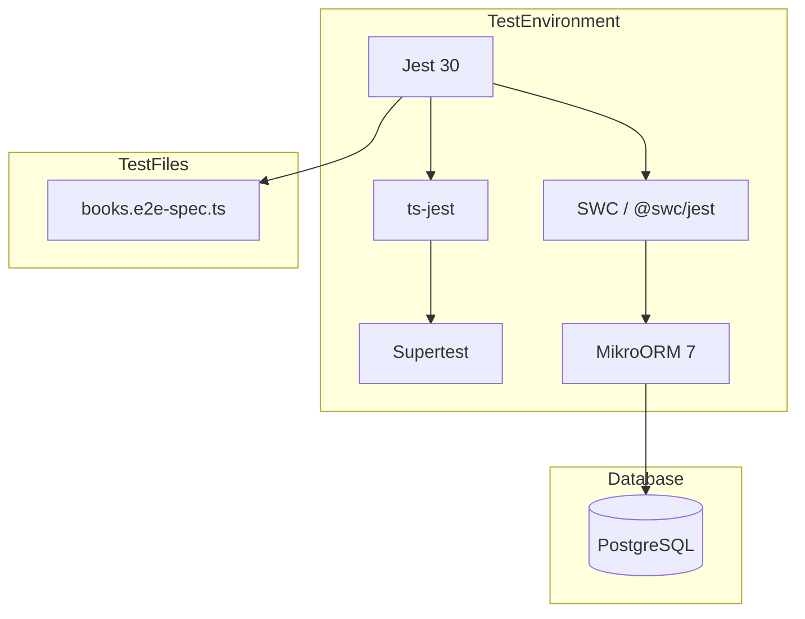
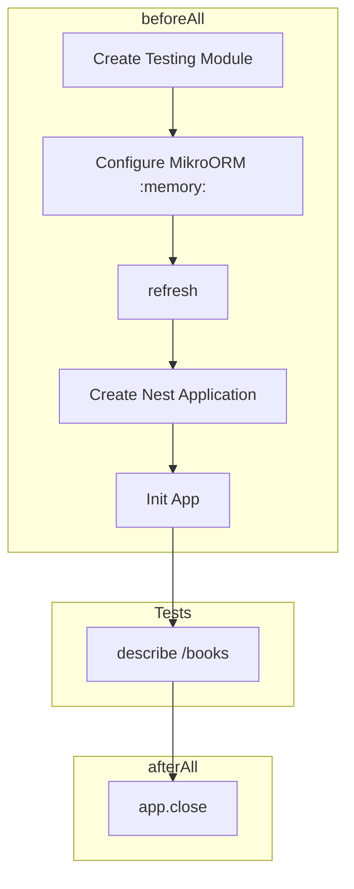

# Testing - E2E Testing Guide

## Configuration


```mermaid
graph TB
    subgraph TestEnvironment
        JEST[Jest 30]
        TSJEST[ts-jest]
        SWC[SWC / @swc/jest]
        SUPER[Supertest]
        MIKRO[MikroORM 7]
    end

    subgraph Database
        PG[(PostgreSQL)]
    end

    subgraph TestFiles
        BOOKS[books.e2e-spec.ts]
    end

    JEST --> TSJEST
    JEST --> SWC
    TSJEST --> SUPER
    SWC --> MIKRO
    MIKRO --> PG
    JEST --> BOOKS
```

## jest-e2e.js

```javascript
module.exports = {
  preset: 'ts-jest',
  testEnvironment: 'node',
  rootDir: '..',
  testMatch: ['<rootDir>/test/**/*.e2e-spec.ts'],
  testPathIgnorePatterns: ['/node_modules/', '/.claude/'],
  moduleFileExtensions: ['ts', 'tsx', 'js', 'json', 'd.ts'],
  collectCoverageFrom: ['<rootDir>/src/**/*.ts'],
  coverageDirectory: '<rootDir>/coverage/e2e',
  coverageReporters: ['text', 'lcov', 'html'],
  coveragePathIgnorePatterns: ['/node_modules/', '<rootDir>/src/main.ts'],
  coverageThreshold: {
    global: { lines: 80, functions: 80, branches: 80, statements: 80 },
  },
  moduleNameMapper: {
    '^src/(.*)$': '<rootDir>/src/$1',
  },
  transform: {
    '^.+\\.(ts|tsx|js|jsx)$': ['@swc/jest', {
      jsc: {
        parser: { syntax: 'typescript', decorators: true },
        target: 'es2021',
        transform: {
          legacyDecorator: true,
          decoratorMetadata: true,
        },
      },
      module: { type: 'commonjs' },
    }],
  },
  transformIgnorePatterns: ['/node_modules/(?!.*(@mikro-orm|kysely|uuid))'],
};
```

## Test Structure


```mermaid
graph TD
    subgraph beforeAll
        A1[Create Testing Module]
        A2[Configure MikroORM :memory:]
        A3[refresh]
        A4[Create Nest Application]
        A5[Init App]
    end

    subgraph Tests
        B1[describe /books]
    end

    subgraph afterAll
        C1[app.close]
    end

    A1 --> A2 --> A3 --> A4 --> A5
    A5 --> B1
    B1 --> C1
```

## Test Module Configuration

```typescript
beforeAll(async () => {
    const moduleFixture: TestingModule = await Test.createTestingModule({
        imports: [
            BooksModule,
        ],
    }).compile();

    const orm = moduleFixture.get(MikroORM);
    await orm.schema.refresh();

    app = moduleFixture.createNestApplication();
    app.useGlobalPipes(
        new ValidationPipe({
            whitelist: true,
            forbidNonWhitelisted: true,
            transform: true,
            transformOptions: {
                enableImplicitConversion: true,
            },
        }),
    );

    await app.init();
});
```

## Books Tests

```typescript
describe('Books Controller (e2e)', () => {
    let app: INestApplication;
    let bookId: string;

    beforeAll(async () => { /* setup */ });

    describe('/books (POST)', () => {
        it('should create a book', () => {
            return request(app.getHttpServer())
                .post('/books')
                .send({
                    title: 'Clean Architecture',
                    author: 'Robert C. Martin',
                    isbn: '978-0-13-468599-1',
                    publicationYear: 2017,
                    genre: 'Software Engineering',
                })
                .expect(201)
                .then((response) => {
                    expect(response.body).toHaveProperty('id');
                    expect(response.body.title).toBe('Clean Architecture');
                    bookId = response.body.id;
                });
        });

        it('should reject a book with duplicate ISBN', async () => {
            await request(app.getHttpServer())
                .post('/books')
                .send({
                    title: 'Another Book',
                    author: 'Someone',
                    isbn: '978-0-13-468599-1',
                    publicationYear: 2020,
                })
                .expect(400);
        });
    });

    describe('/books (GET)', () => {
        it('should list all books', () => {
            return request(app.getHttpServer())
                .get('/books')
                .expect(200)
                .then((response) => {
                    expect(response.body).toHaveProperty('books');
                    expect(Array.isArray(response.body.books)).toBe(true);
                });
        });
    });

    describe('/books/:id (GET)', () => {
        it('should return a book by ID', () => {
            return request(app.getHttpServer())
                .get(`/books/${bookId}`)
                .expect(200)
                .then((response) => {
                    expect(response.body.id).toBe(bookId);
                });
        });

        it('should return 404 for unknown ID', () => {
            return request(app.getHttpServer())
                .get('/books/non-existent-id')
                .expect(404);
        });
    });

    describe('/books/:id (PUT)', () => {
        it('should update a book', () => {
            return request(app.getHttpServer())
                .put(`/books/${bookId}`)
                .send({ title: 'Updated Title' })
                .expect(200)
                .then((response) => {
                    expect(response.body.title).toBe('Updated Title');
                });
        });
    });

    describe('/books/:id (DELETE)', () => {
        it('should delete a book', () => {
            return request(app.getHttpServer())
                .delete(`/books/${bookId}`)
                .expect(204);
        });
    });
});
```

## Running Tests

```bash
# All E2E tests
pnpm test:e2e

# Single file
npx jest --config ./test/jest-e2e.js --testPathPattern=books

# E2E with coverage (writes to coverage/e2e/, fails below 80% threshold)
pnpm test:e2e:cov

# Unit with coverage (writes to coverage/unit/)
pnpm test:cov
```

## Coverage

Coverage is collected per suite into separate directories so each can run
independently and both can feed external quality gates:

| Suite | Output dir                | lcov path                      |
|-------|---------------------------|--------------------------------|
| Unit  | `coverage/unit/`          | `coverage/unit/lcov.info`      |
| E2E   | `coverage/e2e/`           | `coverage/e2e/lcov.info`       |

Both Jest configs enforce an **80% threshold** on lines, functions, branches
and statements — the build fails if any metric drops below. `src/main.ts`
(app bootstrap) is excluded from coverage because it is not exercised by the
test suites.

### SonarQube integration

Feed both reports to SonarQube via comma-separated paths in
`sonar-project.properties`:

```properties
sonar.javascript.lcov.reportPaths=coverage/unit/lcov.info,coverage/e2e/lcov.info
```

## Important Notes

1. **Database**: Tests use PostgreSQL via Docker (`pnpm docker:up` before running)
2. **Schema refresh**: `orm.schema.refresh()` recreates tables before tests
3. **Auto cleanup**: `afterAll` closes the application
4. **Unique IDs**: IDs are UUIDs generated on each run
5. **ESM transform**: MikroORM 7 and uuid 14 are ESM-only — `@swc/jest` transforms them to CJS for Jest
